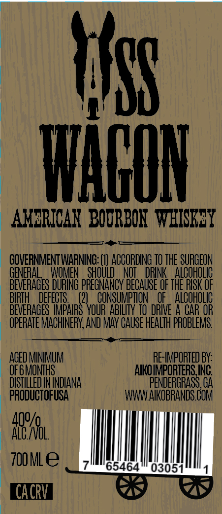

# TTB COLA Label Images - TTBID 26174001000260

**Brand Name:** ASS WAGON

**Issue Date:** 06/26/2026

**Origin Code:** 00

**Product Class/Type:** 141

**Source:** [TTB Public COLA Registry](https://ttbonline.gov/colasonline/viewColaDetails.do?action=publicFormDisplay&ttbid=26174001000260)

## Label Images

### Label 1

## Extracted Label Text

*Text extracted via OCR - may contain errors*

### Label 1

HF
MHGUN
AMERICAN   BOURBON   WHISREY
GOVERNMENTWARNING: (0) ACCORDING TO THE SURGEON
GENERAL
WOMEN _ ShOULD = NOI   DRINK = AlCohOLIC
BEVERAGES DURING PREGNANCY BECAUSE OF THE RISK OF
BIRTH
DEFECIS
(2)
CONSUMPTLON
OF
AlCohOlic
BEVERAGES IMPAIRS YOUR  ABILTY TO DRIE A CAR OR
OPERATE MACHINERY,AND MAY CAUSE HEALTH PROBLEMS.
AGED MINIMUM
RE-IMPORTEDBY:
OF GMONTHS
AIKOIMPORTERS ING
DISTILLEDININDIANA
PENDERGRASS GA
PRODUCTOFUSA
WWWAIKOBRANDS COM
ARrl
7oMle
65464
03051
CACRV
