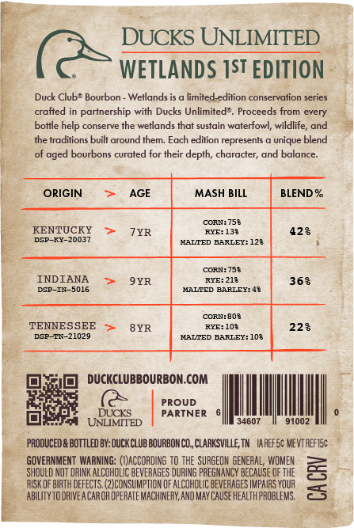
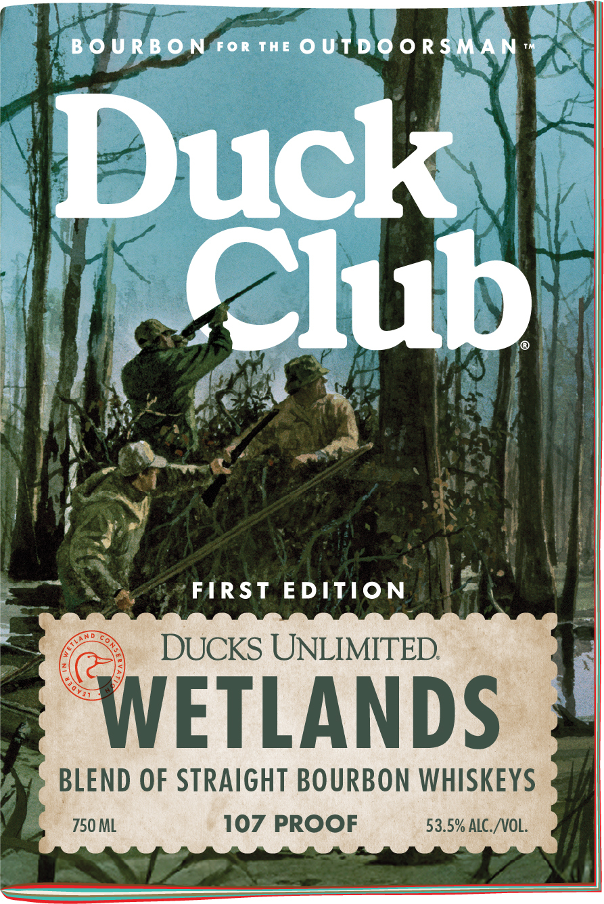

# TTB COLA Label Images - TTBID 26174001000273

**Brand Name:** DUCK CLUB

**Issue Date:** 06/30/2026

**Origin Code:** 43

**Product Class/Type:** 121

**Source:** [TTB Public COLA Registry](https://ttbonline.gov/colasonline/viewColaDetails.do?action=publicFormDisplay&ttbid=26174001000273)

## Label Images

### Back Label

### Front Label

### Label 2

## Extracted Label Text

*Text extracted via OCR - may contain errors*

*1 image(s) excluded: text did not meet readability threshold*

**Detected Proof:** 107
**Detected Age:** 7 Years

### Back Label

DUCKS UNLIMITED
WETLANDS IST EDITION
Duck Clubo Bourbon
Wetlands is
limited-edition conservation series
crafted in partnership with Ducks Unlimited?,
Proceeds
every
bottle help conserve the wetlands that sustain waterfowl; wildlife; and
the traditions built around them: Each edition represents
unique blend
bourbons curated for their depth, character; and balance_
ORIGIN
AGE
MASH BILL
BLEND %
CORIA758
KENTUCKY
7YR
RYE: 133
428
DGP-RY-20037
MALTED BARLEY: 128
CORIA758
INDIANA
9YR
RXE: 218
368
DSP-I4-
5016
MALTED BARLEY: 48
CORN: 803
TENNESSEE
8YR
Wala
228
DGP-TI-21020
HALTED BARLEY: 10$
DUCKCLUBBOURBON.COM
PROUD
DUCKS
PARTNER
UNLIMITED
34607
91002
PRODUCED & BOTTLED BY: DUCXCLub BOURBONCO, CLARKSVILLE, TM  IAreFS: VEVTFEFTE;
GOVERNMENT  WARNING: (OJACCORDING TO THE SURGEON GENERAL; WOMEN
SHQULD MOT DRINK ALCOHOLIC BEVERAGES DURING PREGMANCY BECAUSE Of THE
RISK OF BIRTH DEfEcts (2)CONSURPTIOM OF ALCOHOLIC BEvERAGES IMPHIAS VOUR
3
ABILITY TODRIVEA CAROR OPERATE MACHUNERY; AND MAy Cause HEALTHPROBLEMS,
from
aged

### Front Label

B 0 U RB O N For ThE 0 UtdooRSMAN
Duck
Club
FIRST
EDITION
DUCKS UNLIMITED
WETLANDS
BLEND OF STRAIGHT BOURBON WHISKEYS
750 ML
107 PROOF
53.5% ALC_NOL:
