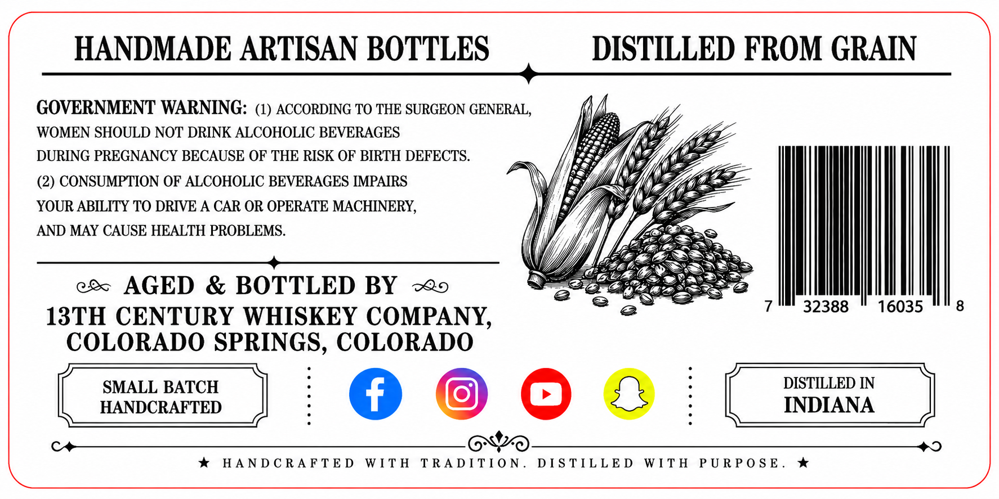
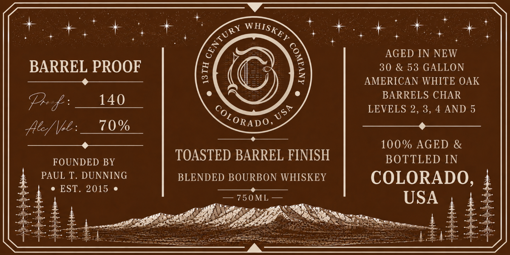

# TTB COLA Label Images - TTBID 26174001000342

**Brand Name:** 13TH CENTURY WHISKEY COMPANY

**Issue Date:** 06/29/2026

**Origin Code:** 13

**Product Class/Type:** 131

**Source:** [TTB Public COLA Registry](https://ttbonline.gov/colasonline/viewColaDetails.do?action=publicFormDisplay&ttbid=26174001000342)

## Label Images

### Back Label

### Front Label

## Extracted Label Text

*Text extracted via OCR - may contain errors*

### Back Label

HANDMADE ARTISAN BOTTLES DISTILLED FROM GRAIN

GOVERNMENT WARNING: (1) ACCORDING TO THE SURGEON GENERAL,
WOMEN SHOULD NOT DRINK ALCOHOLIC BEVERAGES
DURING PREGNANCY BECAUSE OF THE RISK OF BIRTH DEFECTS. | | | )
ex AGED & BOTTLED BY ~o5 eu =
13TH CENTURY WHISKEY COMPANY, e elit ih eta
COLORADO sia ee COLORADO

(2) CONSUMPTION OF ALCOHOLIC BEVERAGES IMPAIRS
| sANDCRAFTED —_| BATCH [ eae | IN
| sANDCRAFTED —_| [ eae |

YOUR ABILITY TO DRIVE A CAR OR OPERATE MACHINERY,
* HANDCRAFTED WITH Se tes DISTILLED WITH PURPOSE.

AND MAY CAUSE HEALTH PROBLEMS.

### Front Label

nae * ts + + .
oe, ee aie Cet, + or eee
&, = 3 AGED IN NEW
BARREL PROOF ish e i 30 & 53 GALLON
prmeaees ena eS) BE q AMERICAN WHITE OAK
e = ° BARRELS CHAR
Prof: 140 __ cop ee LEVELS 2, 3, 4 AND 5
Ae/\oe:__10% cones ee
ae “ 100% AGED &
OORT TERT TOASTED BARREL FINISH BOTTLED IN
PAUL T. DUNNING BLENDED BOURBON WHISKEY COLORADO,
* EST. 2015 « es
aS USA ;
