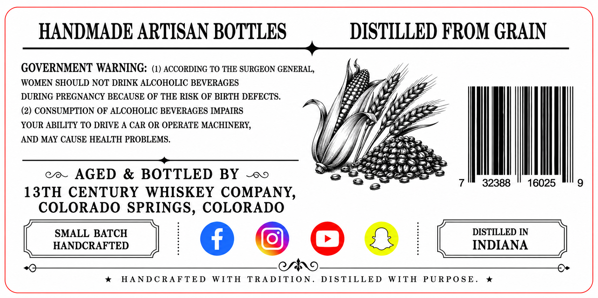
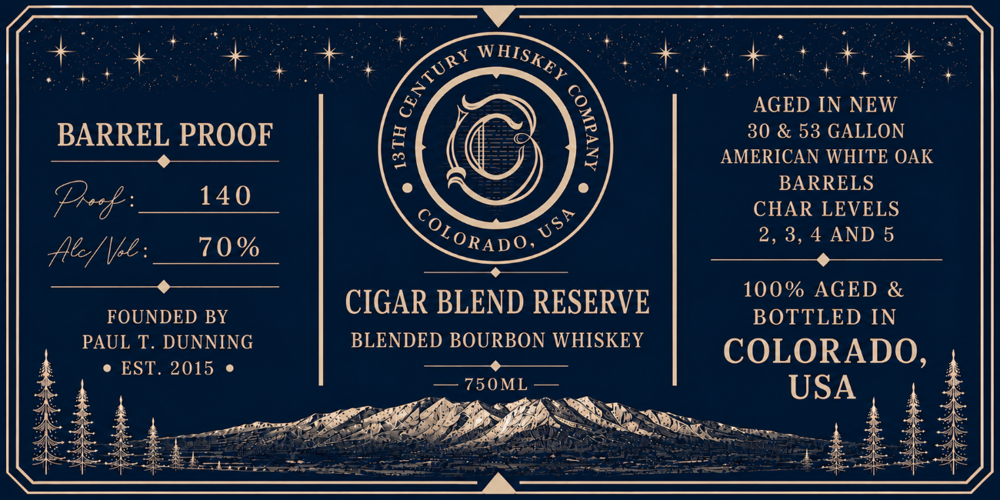

# TTB COLA Label Images - TTBID 26174001000348

**Brand Name:** 13TH CENTURY WHISKEY COMPANY

**Issue Date:** 06/29/2026

**Origin Code:** 13

**Product Class/Type:** 131

**Source:** [TTB Public COLA Registry](https://ttbonline.gov/colasonline/viewColaDetails.do?action=publicFormDisplay&ttbid=26174001000348)

## Label Images

### Back Label

### Front Label

## Extracted Label Text

*Text extracted via OCR - may contain errors*

### Back Label

HANDMADE ARTISAN BOTTLES
DISTILLED FROM GRAIN
GOVERNMENT WARNING: (1) ACCORDING TO THE SURGEON GENERAL,
WOMEN SHOULD NOT DRINK ALCOHOLIC BEVERAGES
DURING PREGNANCY BECAUSE OF THE RISK OF BIRTH DEFECTS.
(2) CONSUMPTION OF ALCOHOLIC BEVERAGES IMPAIRS
YOUR ABILITY TO DRIVE A CAR OR OPERATE MACHINERY;
AND MAY CAUSE HEALTH PROBLEMS.
AGED
& BOTTLED BY
32388
16025
9
13TH CENTURY
WHISKEY COMPANY,
COLORADO SPRINGS, COLORADO
SMALL BATCH
DISTILLED IN
HANDCRAFTED
INDIANA
9
HANDC RA FTED
WITH
TRADITION_
DIS TILLED
WITH
PURPO S E _

### Front Label

a <2 ae : pode op ne fe . ; i
ete ey Re ee a Eee Pore
&; 3 AGED IN NEW
BARREL PROOF = (G 2 30 & 53 GALLON
fe ecto inal Ss J) Jz AMERICAN WHITE OAK
BARRELS
nee = & CHAR LEVELS
fle \pe: 70% LORapo.” 2, 3,4 AND 5
aa 100% AGED &
%
FOUNDED BY CIGAR BLEND RESERVE BOTTLED IN
PAUL T. DUNNING BLENDED BOURBON WHISKEY
: © EST. 2015 eee Saas COLORADO, 4
x eS USA é
mia SES Se ee Fee ieee 4: :: panes ee
