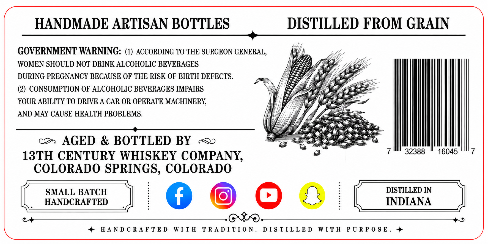
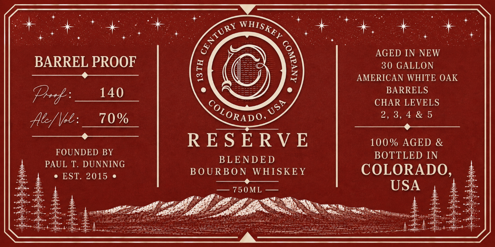

# TTB COLA Label Images - TTBID 26174001000367

**Brand Name:** 13TH CENTURY WHISKEY COMPANY

**Issue Date:** 06/29/2026

**Origin Code:** 13

**Product Class/Type:** 131

**Source:** [TTB Public COLA Registry](https://ttbonline.gov/colasonline/viewColaDetails.do?action=publicFormDisplay&ttbid=26174001000367)

## Label Images

### Back Label

### Front Label

## Extracted Label Text

*Text extracted via OCR - may contain errors*

### Back Label

Pa

x

HANDMADE ARTISAN BOTTLES

DISTILLED FROM GRAIN

GOVERNMENT WARNING: (1) ACCORDING TO THE SURGEON GENERAL

WY

WOMEN SHOULD NOT DRINK ALCOHOLIC BEVERAGES

We

DURING PREGNANCY BECAUSE OF THE RISK OF BIRTH DEFECTS.

Ze

(2) CONSUMPTION OF ALCOHOLIC BEVERAGES IMPAIRS

rM,

(Si

WA)

‘B

a —

———

YOUR ABILITY TO DRIVE A CAR OR OPERATE MACHINERY,

AND MAY CAUSE HEALTH PROBLEMS

i

We,

Paes

SD Raaee

SZ]

I< >

Bese

co. AGED & BOTTLED BY «<>

Mil

13TH CENTURY WHISKEY COMPANY.

32388

16045

COLORADO SPRINGS, COLORADO

DISTILLED IN

SMALL BATCH

HANDCRAFTED

INDIANA

(

)

G@O0e8

)

Ce

5

+ HANDCRAFTED WITH TRADITION

DISTILLED WITH PURPOSE. +

\

#

### Front Label

Fe?

BARREL PROOF

Poof: 140

Ale/ ol: 10%

FOUNDED BY
PAUL T. DUNNING

lee

BLENDED
BOURBON WHISKEY

Ty Caen
—-75 0M —
GER ts

AGED IN NEW
30 GALLON
AMERICAN WHITE OAK
BARRELS
CHAR LEVELS
2,3,4&5
sessile se Co abe EE
100% AGED &
BOTTLED IN

COLORADO,
USA

~ a atti
