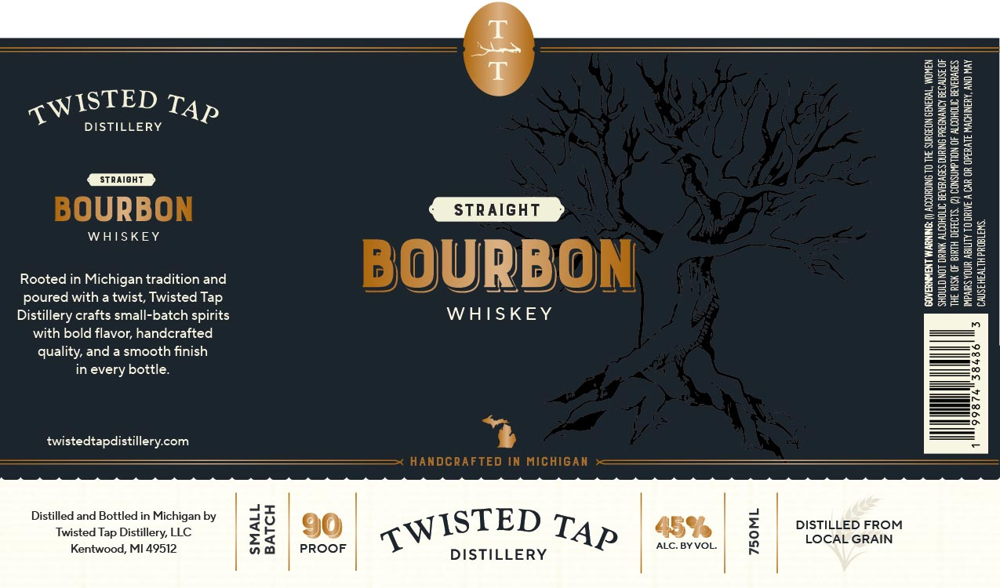

# TTB COLA Label Images - TTBID 26174001000386

**Brand Name:** TWISTED TAP DISTILLERY

**Issue Date:** 06/30/2026

**Origin Code:** 06

**Product Class/Type:** 101

**Source:** [TTB Public COLA Registry](https://ttbonline.gov/colasonline/viewColaDetails.do?action=publicFormDisplay&ttbid=26174001000386)

## Label Images

### Label 1

## Extracted Label Text

*Text extracted via OCR - may contain errors*

### Label 1

T
1
DISTILLERY
I
H
Straioht
BOURBON
WHISKEY
Straight
1
1
1
Rooted in Michigan tradition and
BOURBON
Hl
8
1
1
poured with a twist, Twisted
Distillery crafts small-batch spirits
WHISKEY
with bold flavor; handcrafted
quality; and a smooth finish
in every bottle:
twistedtapdistillerycom
HANDCRAFTED IN Michigan
Distilled and Bottled in Michigan by
Twisted Tap Distillery; LLC
Ji
459
1
DISIAEGRROM
Kentwood, MI 49512
PROOF
ALC. BYVOL:
DISTILLERY
TWISTED
TAP
Tap
TWISTED
TAP
