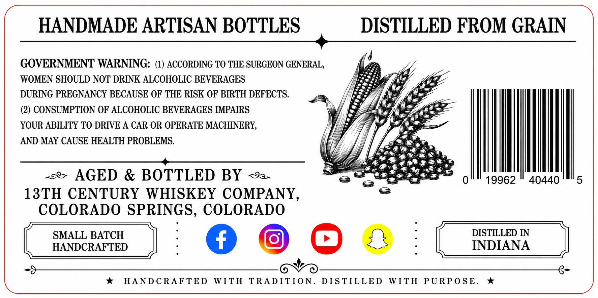
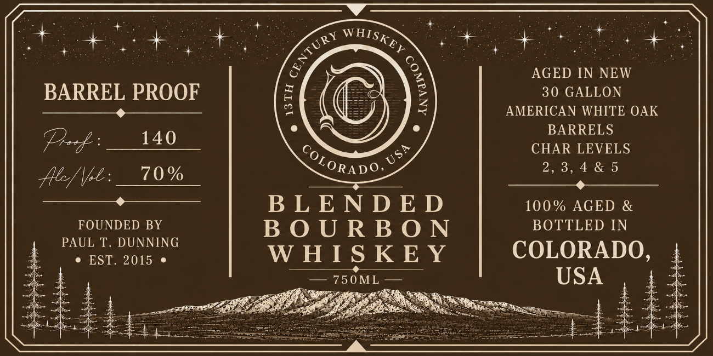

# TTB COLA Label Images - TTBID 26174001000391

**Brand Name:** 13TH CENTURY WHISKEY COMPANY

**Issue Date:** 06/29/2026

**Origin Code:** 13

**Product Class/Type:** 131

**Source:** [TTB Public COLA Registry](https://ttbonline.gov/colasonline/viewColaDetails.do?action=publicFormDisplay&ttbid=26174001000391)

## Label Images

### Back Label

### Front Label

## Extracted Label Text

*Text extracted via OCR - may contain errors*

**Detected Proof:** 60

### Back Label

HANDMADE ARTISAN BOTTLES
DISTILLED FROM GRAIN
GOVERNMENT WARNING: (1) ACCORDING TO THE SURGEON GENERAL,
WOMEN SHOULD NOT DRINK ALCOHOLIC BEVERAGES
DURING PREGNANCY BECAUSE OF THE RISK OF BIRTH DEFECTS.
(2) CONSUMPTION OF ALCOHOLIC BEVERAGES IMPAIRS
YOUR ABILITY TO DRIVE A CAR OR OPERATE MACHINERY,
AND MAY CAUSE HEALTH PROBLEMS:
AGED & BOTTLED BY
0
19962
40440
5
13TH CENTURY WHISKEY COMPANY,
COLORADO SPRINGS, COLORADO
SMALL BATCH
DISTILLED IN
HANDCRAFTED
INDIANA
HAND C RAFTED
WITH
TRADITION_
DIS TILLED
WITH
PURPO SE _

### Front Label

+

=

7 ee

SS

anes

at

OF

+

AGED IN NEW

BARREL PROOF

30 GALLON

AMERICAN WHITE OAK

else

BARRELS

Pf

Ss

CHAR LEVELS

eee mee

70%

CcORADO

a es

2,3,4&5

FOUNDED BY

BLENDED

100% AGED &

BOTTLED IN

PAUL T. DUNNING

BOURBON

e EST. 2015 e

WHISKEY

COLORADO,

— 750M

USA

—

4 A

$3he7

ree

ascent

;
