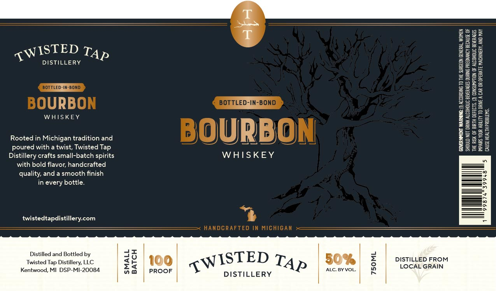

# TTB COLA Label Images - TTBID 26174001000393

**Brand Name:** TWISTED TAP DISTILLERY

**Fanciful Name:** BOTTLED-IN-BOND BOURBON WHISKEY

**Issue Date:** 07/01/2026

**Origin Code:** 06

**Product Class/Type:** 111

**Source:** [TTB Public COLA Registry](https://ttbonline.gov/colasonline/viewColaDetails.do?action=publicFormDisplay&ttbid=26174001000393)

## Label Images

### Label 1

## Extracted Label Text

*Text extracted via OCR - may contain errors*

### Label 1

WISTED T4,

DISTILLERY

WHISKEY

Rooted in Michigan tradition and
poured with a twist, Twisted Tap
Distillery crafts small-batch spirits
with bold flavor, handcrafted
quality, and a smooth finish
in every bottle.

twistedtapdistillery.com

Distilled and Bottled by
Twisted Tap Distillery, LLC
Kentwood, MI DSP-MI-20084

WHISKEY

DISTILLERY

Ap

50% |

| ALC. BYVOL.

| DISTILLED FROM
| LOCAL GRAIN

() ACCORDING TO THE SURGEON GENERAL WOMEN

‘SHOULD NOT DRINK ALCOHOLIC BEVERAGES DURING PREGNANCY BECAUSE OF
THE RIK OF BIRTH DEFECTS. (2) CONSUMPTION OF ALCCHOUC BEVERAGES

IMPAIRS YOUR ABILITY TO DRE A CAR OR OPERATE MACHINERY, AND MAY

‘CAUSE HEALTH PROBLEMS,

‘GOVERNMENT WARNENE:
