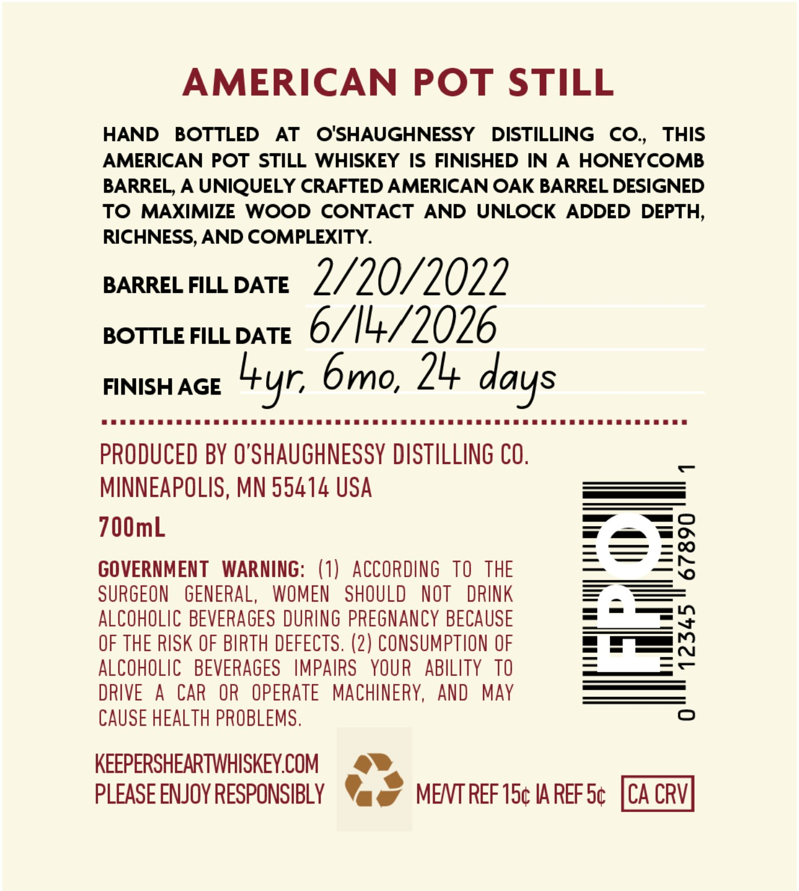
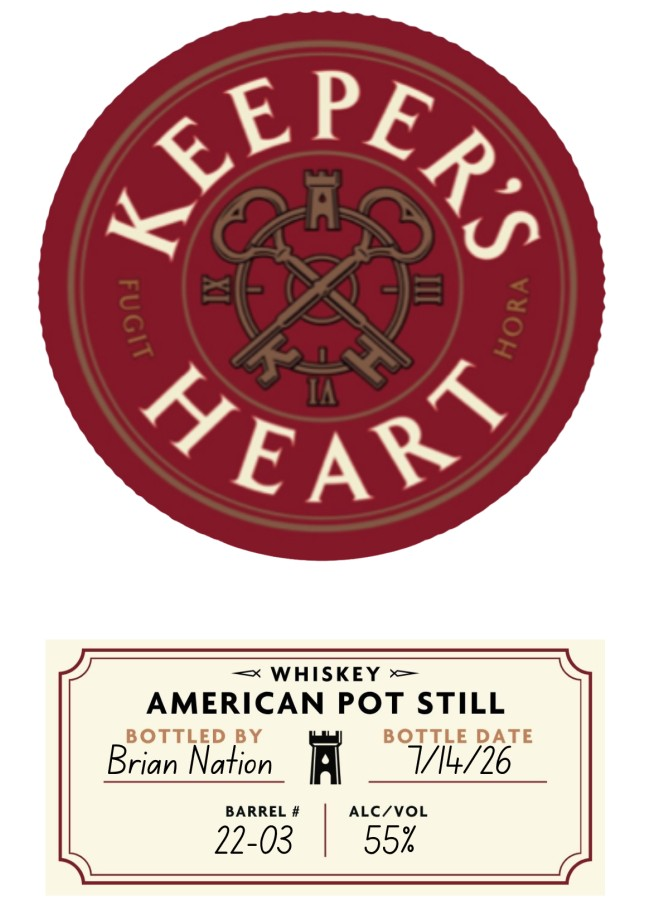

# TTB COLA Label Images - TTBID 26174001000404

**Brand Name:** KEEPER'S HEART

**Fanciful Name:** AMERICAN POT STILL

**Issue Date:** 07/07/2026

**Origin Code:** 27

**Product Class/Type:** 140

**Source:** [TTB Public COLA Registry](https://ttbonline.gov/colasonline/viewColaDetails.do?action=publicFormDisplay&ttbid=26174001000404)

## Label Images

### Back Label

### Label 1

## Extracted Label Text

*Text extracted via OCR - may contain errors*

### Back Label

AMERICAN
POT STILL
HAND
BOTTLED
AT
O'SHAUGHNESSY
DISTILLING
CO,
THIS
AMERICAN POT STILL WHISKEY IS FINISHED IN
A
HONEYCOMB
BARREL, A UNIQUELY CRAFTED AMERICAN OAK BARREL DESIGNED
TO
MAXIMIZE
WOOD
CONTACT
AND
UNLOCK
ADDED DEPTH,
RICHNESS, AND COMPLEXITY.
BARREL FILL DATE
2/20/2022
BOTTLE FILL DATE
6/14/2026
FINISH AGE
bmo, 24
PRODUCED BY O'SHAUGHNESSY DISTILLING CO,
MINNEAPOLIS, MN 55414 USA
700mL
GOVERNMENT
WARNING: (1)
ACCORdiNG   TO   THE
2
SURGEON
GENERAL,
WOMEN
SHOULD
NOT
DRINK
ALCOHOLIC BEVERAGES DURING pReGNAnCY BECAUSE
OF THE RISK OF BIRTH DEFECTS. (2) CONSUMPTION OF
3
ALCOHOLIC   BEVERAGES
IMPAIRS
YOUR   ABILITY TO
DRIVE
A
CAR
OR
OPERATE
MACHINERY,
AND
MAY
CAUSE HEALTH PROBLEMS ,
0
KEEPERSHEARTWHISKEY.COM
PLEASE ENJOY RESPONSIBLY
MENT REF 15c IA REF Sc
CA CRV
days
Lyr,
=

### Label 1

EPE,

Caan

—= WHISKEY —

AMERICAN POT STILL

BOTTLED

TTLE DATE

Brian Nation

Ai

V14/26

22-03

BARREL #

ALC/VOL

55k
