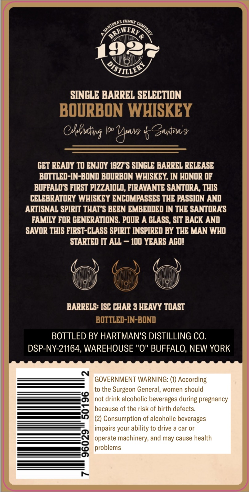
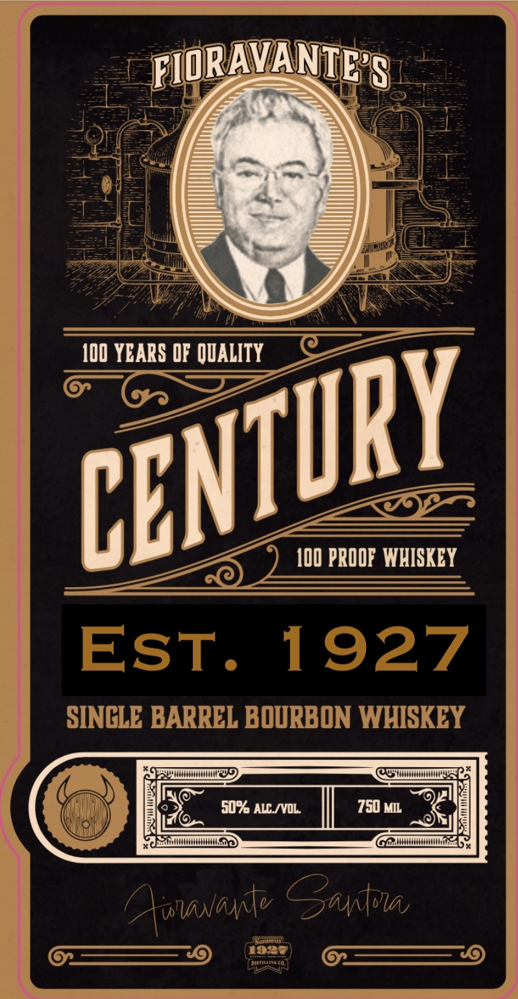

# TTB COLA Label Images - TTBID 26174001000407

**Brand Name:** 1927

**Fanciful Name:** CENTURY

**Issue Date:** 07/27/2026

**Origin Code:** 02

**Product Class/Type:** 111

**Source:** [TTB Public COLA Registry](https://ttbonline.gov/colasonline/viewColaDetails.do?action=publicFormDisplay&ttbid=26174001000407)

## Label Images

### Back Label

### Front Label

## Extracted Label Text

*Text extracted via OCR - may contain errors*

### Back Label

FAMILY
d
192
RSTILLIA )
SINCLE BARREL SELECTION
BOURBON WHISKEY
@Akatiwg
Ioo
Uw bGaytvu?
GET READY TO ENJOY 1927*$ SINCLE BARREL RELEASE
BOTTLED-IN-BOND BOURBON WHISKEY: WN HONOR @F
BUFFALOS FIRST PIZZAIOLO, FIRAVANTE SANTORA, THIS
CELEBRATORY WHISKEY ENCOMPASSES THE PASSION AND
ARTISNAL SPIRIT THAT S BEEN EMBEDDED IN THE SANTORAS
FAMILY FOR GENERATIONS. POUR A GLASS, SIT BACK AND
SAVOR THIS FIRST-CLASS SPIRIT INSPIRED BY THE MAN WHO
STARTED IT ALL
I00 YEARS ACOI
BARRELS: ISC CHAR 3 HEAVY TOAST
BOTTLED-IN-BOND
BOTTLED BY HARTMAN'S DISTILLING CO.
DSP-NY-21164, WAREHOUSE "0" BUFFALO, NEW YORK
GOVERNMENT WARNING: (1) According
to the
Surgeon General, women should
not drink alcoholic beverages during pregnancy
8
because of the risk of birth defects.
(2) Consumption of alcoholic beverages
impairs your ability to drive a car or
8
operate machinery; and may cause health
problems
0
SantORAS
cumpa
OREWERY

### Front Label

FIORAVANTE'S
I0D YEARS QF  QUALITY
I0O PRODF  WHISKEY
Est_
1927
SINCLE BARREL BOURBON WHISKEY
50% ALL IVL
750 MIL
finNanfv Gantow,
anloiur]
CENTURY
