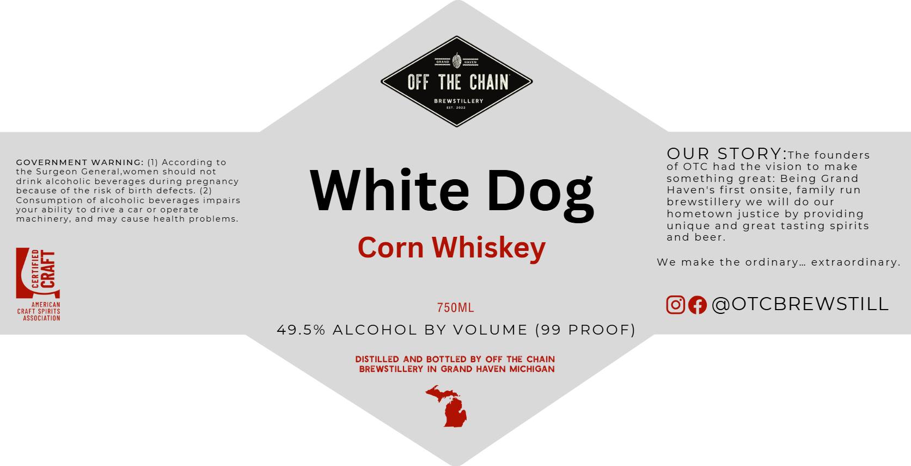

# TTB COLA Label Images - TTBID 26174001000537

**Brand Name:** OFF THE CHAIN BREWSTILLERY

**Fanciful Name:** WHITE DOG

**Issue Date:** 06/29/2026

**Origin Code:** 06

**Product Class/Type:** 143

**Source:** [TTB Public COLA Registry](https://ttbonline.gov/colasonline/viewColaDetails.do?action=publicFormDisplay&ttbid=26174001000537)

## Label Images

### Label 1

## Extracted Label Text

*Text extracted via OCR - may contain errors*

**Detected Proof:** 99

### Label 1

E
OFF THE   CHAIN
BREWStillery
OUR STORY:The founders
GOVERNMENT WARNING: (1) According
of OTC had the vision to
make
the Surgeon Genera
women should
not
drink alcoholic beverages during
something great: Being Grand
because of
the risk of birth defects_
reznancy
White Dog
Haven's first onsite, family
run
Consumption
of alcoholic beverages impairs
brewstillery
we will do
our
your ability
[0 drive
car
or operate
hometown justice by providing
machinery_
and
may
cause health problems
unique
and great tasting spirits
and beer
Corn
Whiskey
We
make the ordinary.
extraordinary
8i
AMERICAM
750ML
@OTCBREWSTILL
CRAFT Spirits
AssociATIOM
49.5%
ALCOHOL
BY VOLUME (99 PROOF)
DISTILLED AND BOTTLED BY OFF THE CHAIN
BRE WSTILLERY IN GRAND HAVEN MICHIGAN
