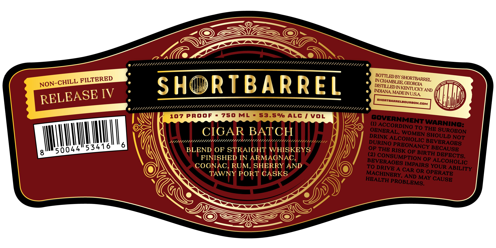

# TTB COLA Label Images - TTBID 26174001000667

**Brand Name:** SHORTBARREL

**Fanciful Name:** CIGAR BATCH

**Issue Date:** 06/29/2026

**Origin Code:** 08

**Product Class/Type:** 120

**Source:** [TTB Public COLA Registry](https://ttbonline.gov/colasonline/viewColaDetails.do?action=publicFormDisplay&ttbid=26174001000667)

## Label Images

### Label 1

## Extracted Label Text

*Text extracted via OCR - may contain errors*

**Detected Proof:** 107

### Label 1

FILTERED
BCHLED BY SHORTBARREL
SH
RTBARREL
K3RSZo
IV
MADE
shortbarrelbourbon;
COM
107 PROOF
750
ML
53.5% ALC / VOL
(1)
SAYCORNGNG :
WARNINGH
CIGAR BATCH
WOMINTSHOSUROEON
1/11/////1/1/
1/1///
////////2
DRINK ALCOHOLBC BBOULD NOT'
53416
6
OURIG
RSRCOOLIC BEVOALSES
8
50044
BLEND OF STRAICHT
WHISKEYS
RISK OF BIRTH
FINISHED IN ARMAGNAC
(2)
CONSUMPTION OF
COGNAC
RUM,
SHERRY AND
TO DRIVE A
ON90R95 OcohOLiTy
TAWNY PORT CASKS
MACHINERY CANDORAOPERATE
HEALTH
MAY
PROBLEMS:
NON-CHILL
INDIANA
RELEASE
INUSA
GENERAL;
THE
DEFECTS:
BEVERACES
CAR
CAUSE
