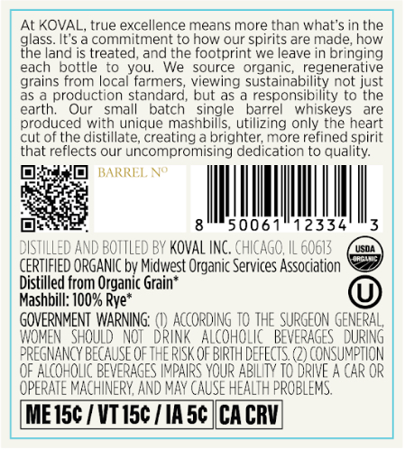
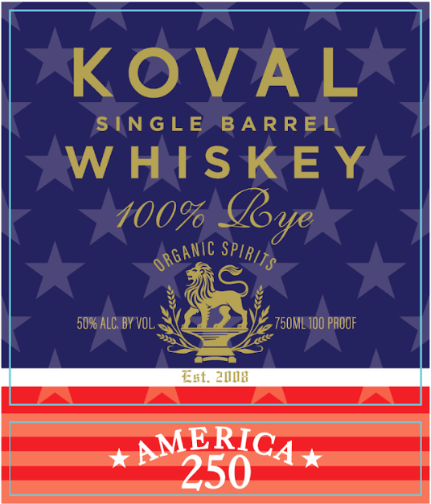

# TTB COLA Label Images - TTBID 26174001000704

**Brand Name:** KOVAL

**Issue Date:** 06/30/2026

**Origin Code:** 04

**Product Class/Type:** 140

**Source:** [TTB Public COLA Registry](https://ttbonline.gov/colasonline/viewColaDetails.do?action=publicFormDisplay&ttbid=26174001000704)

## Label Images

### Back Label

### Front Label

## Extracted Label Text

*Text extracted via OCR - may contain errors*

**Detected Proof:** 100

### Back Label

At KOVAL, true excellence means more than what's in the
%less
It $
commitment tO now our spirits are made; how
land is treated, and
footprint we leave in bringing
each
bottle
t0 You:
We
source
organic
regenerative
grains from local farmers
viewing sustainability not just
production standard
but as a responsibility to the
Our
small
patcn
barrel
whiskeys
are
produced with unique
trlashbiofe uthazrrg onhyskee heare
cut of the distillate; creating a brighter; more refined spirit
that reflects our uncompromising dedication to quality:
BARREL VO
50061"12334
DISTILLED and BOTTLED BY KovAL InC. chICaGO,
60613
CERTIFIED ORGANIC bv Midwest Organic Services Association
Distilled from Organic Grain*
Mashbill: 10O% Rye*
GOVERNMENT WARNING:
AccORDING TO THE SURGEON
 GEURAG
WOMEN   Should  NOT' drink   AlcoholIc   BEVERAGES
PREGNANCY BECAUSE OETHE RISK QF BIRTH DEFECTS (2) CONSUMPTION
OF AlcohOLC BEVERAGES IMPAIRS YOUR ABILITY TO DRIVE A CAR OR
OPERATE MACHINERY; And MaY CAUSe HEALTH PROBLEMS
MEisc / Vt 15c / IAsc ICA CRV
the
earth;

### Front Label

KOVAL
SINGLE
BA R REL
W HIS KE
100%
50% ALC, BY VOL,
750ML 100 PROOF
Est. 28
AMERICA
250
Jy
organic
SPIRITS
