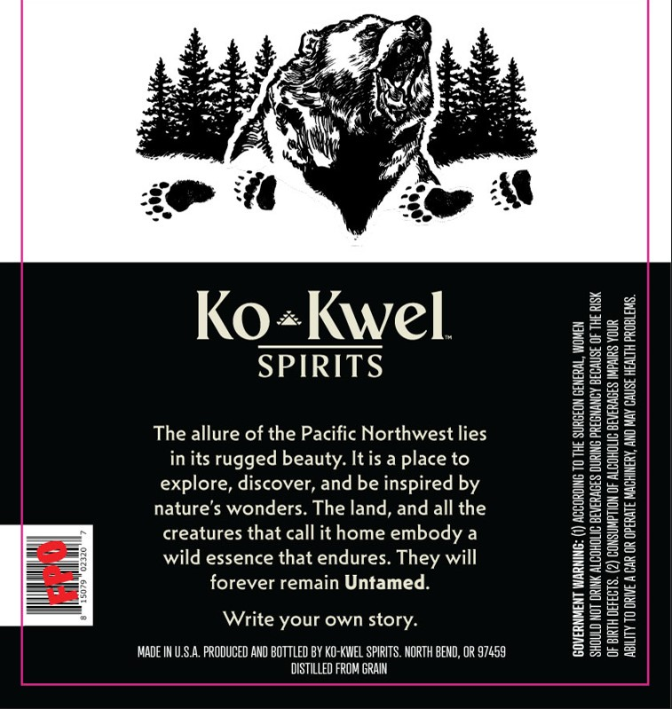
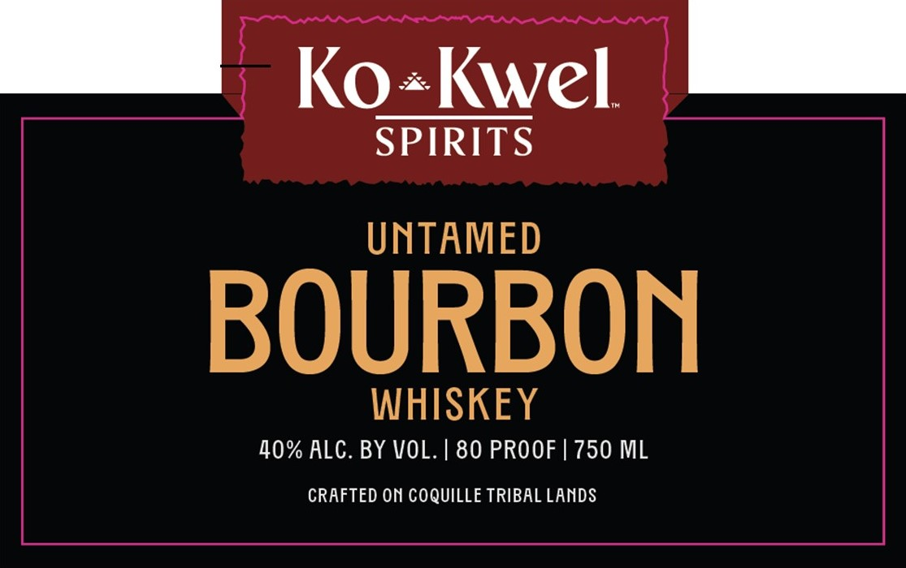
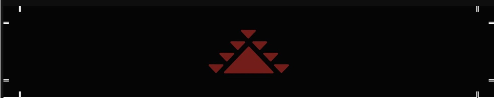

# TTB COLA Label Images - TTBID 26174001000730

**Brand Name:** KO-KWEL SPIRITS

**Fanciful Name:** UNTAMED

**Issue Date:** 07/08/2026

**Origin Code:** 38

**Product Class/Type:** 141

**Source:** [TTB Public COLA Registry](https://ttbonline.gov/colasonline/viewColaDetails.do?action=publicFormDisplay&ttbid=26174001000730)

## Label Images

### Back Label

### Front Label

### Label 3

## Extracted Label Text

*Text extracted via OCR - may contain errors*

*1 image(s) excluded: text did not meet readability threshold*

**Detected Proof:** 80

### Back Label

Ko«Kwel

SPIRITS

The allure of the Pacific Northwest lies
in its rugged beauty. It is a place to
explore, discover, and be inspired by
nature’s wonders. The land, and all the
creatures that call it home embody a
wild essence that endures. They will
forever remain Untamed.

Write your own story.

MADE IN U.S.A. PRODUCED AND BOTTLED BY KO-KWEL SPIRITS. NORTH BEND, OR $7459
DISTILLED FROM GRAIN

‘SHOULD NOT DRINK ALCOHOLIC BEVERAGES DURING PREGNANCY BECAUSE OF THE RISK
OF BIRTH DEFECTS. (2) CONSUMPTION OF ALCOHOLIC BEVERAGES IMPAIRS YOUR

GOVERNMENT WARNING: (1) ACCORDING TO THE SURGEON GENERAL, WOMEN

ABILITY TO DRIVE A CAR OR OPERATE MACHINERY, ANO MAY CAUSE HEALTH PROBLEMS.

### Front Label

Ko
Kwel
SPIRITS
UNTAMED
BOURBON
WHISKEY
40% ALC. BY VOL. | 80 PROOF | 750 ML
CRAFTED ON COQUILLE TRIBAL LANDS
