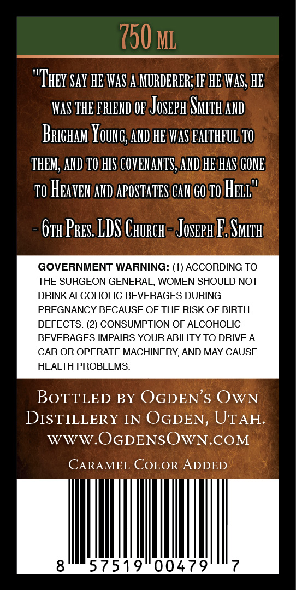
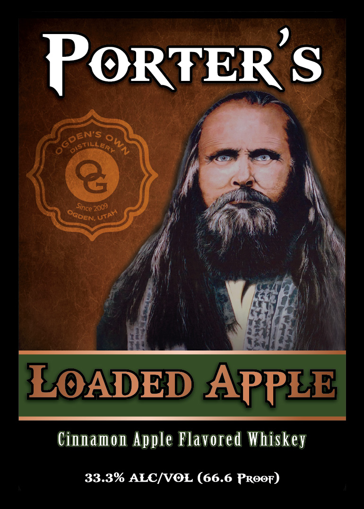

# TTB COLA Label Images - TTBID 26174001000829

**Brand Name:** PORTER'S

**Fanciful Name:** PORTER'S LOADED APPLE FLAVORED WHISKEY

**Issue Date:** 06/29/2026

**Origin Code:** 45

**Product Class/Type:** 149

**Source:** [TTB Public COLA Registry](https://ttbonline.gov/colasonline/viewColaDetails.do?action=publicFormDisplay&ttbid=26174001000829)

## Label Images

### Back Label

### Label 1

## Extracted Label Text

*Text extracted via OCR - may contain errors*

**Detected Proof:** 66.6

### Back Label

750 ML
Say HE VAS
MURDERER; IF HE WaS; HE
waS THE FRIEHD OF Joseph SMizh Ahd
Brighan Young;, AND HE WAS FAITHFUL T0
THEM; AND 10 HIS COVENANTS,AND HE HaS GOIE
T0 HEaVEN AHD APOSTATES CAH GO z0 Hell"
6th Pres LDS CHuRch = Joseph F SMITh
GOVERNMENT WARNING: (1) ACCORDING TO
THE SURGEON GENERAL WOMEN SHOULD NOT
DRINK ALCOHOLIC BEVERAGES DURING
PREGNANCY BECAUSE OF THE RISK OF BIRTH
DEFECTS. (2) CONSUMPTION OF ALCOHOLIC
BEVERAGES IMPAIRS YOUR ABILITY TO DRIVE A
CAR OR OPERATE MACHINERY, AND MAY CAUSE
HEALTH PROBLEMS_
BoTTLED BY OGDEN'$ OwN
DISTILLERY IN OGDEN, UTAH:
WWW OGDENSOWN.COM
CARAMEL COLOR
ADDED
8
57519
00479
"They "

### Label 1

PoRTERs
Oistiller)l
2009
LOADED APPLE
Cinnamon Apple Flavored Whiskey
33.3% ALC/VOL (66.6 PROoF)
GDEN'$
'Since
UTAH
Ogder
