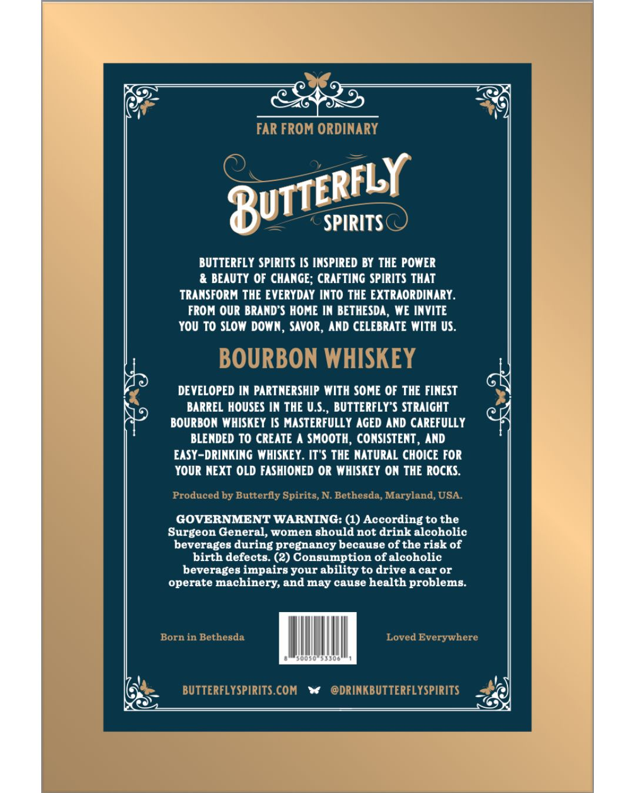
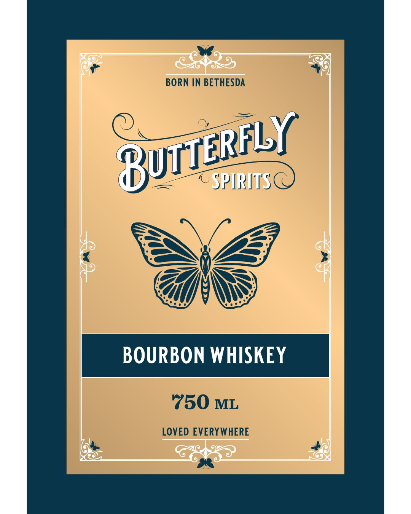
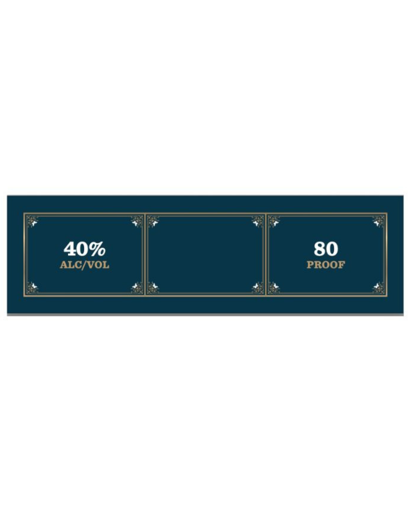

# TTB COLA Label Images - TTBID 26174001000917

**Brand Name:** BUTTERFLY SPIRITS

**Issue Date:** 06/29/2026

**Origin Code:** 25

**Product Class/Type:** 141

**Source:** [TTB Public COLA Registry](https://ttbonline.gov/colasonline/viewColaDetails.do?action=publicFormDisplay&ttbid=26174001000917)

## Label Images

### Back Label

### Front Label

### Label 3

## Extracted Label Text

*Text extracted via OCR - may contain errors*

*1 image(s) excluded: text did not meet readability threshold*

### Back Label

FAR FROM ORDINARY
SPIRITSC
BUTTERFLY SPIRITS IS INSPIRED BY THE POWER
& BEAUTY OF CHANGE; CRAFTING SPIRITS THAT
TRANSFORM THE EVERYDAY INTO THE EXTRAORDINARY
FROM Our BRAND'S HOME IN BETHESDA , WE INVITE
YoU To SLOW DOWN, SaVOR, AND CELEBRATE WITH US.
BOURBON WHISKEY
DEVELOPED IN PARTNERSHIP WITH SOME OF THE FINEST
BARREL HOUSES IN THE U.S:
BUTTERFLY S STRAIGHT
BOURBON WHISKEY IS MASTERFULLY AGED AND CAREFULLY
BLENDED To CREATE ^ SMOOTH, CONSISTENT , AND
EASY-DRINKING WHISKEY . IT"S THE NATURAL CHOICE FOR
YOUR NEXT OLD FASHIONED OR WHISKEY ON THE ROCKS:
Produced by Butterfly Spirits, N Bethesda, Maryland, USA
GOVERNMENT WARNING: (1) According to the
Surgeon General, women should not drink alcoholic
beverages during pregnancy because of the risk of
birth defects: (2) Consumption of alcoholic
beverages impairs your abilityto drive a car or
operate machinery, and may cause health problems:
Born in Bethesda
Loved Everywhere
BUTTERFLYSPIRITS COM
@DRINKBUTTERFLYSPIRITS
BUTTERFLY

### Front Label

muytl abl

SPIRITS

BOURBON WHISKEY
