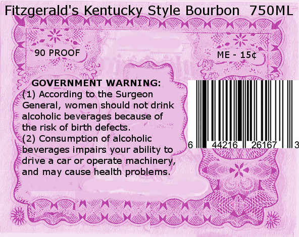
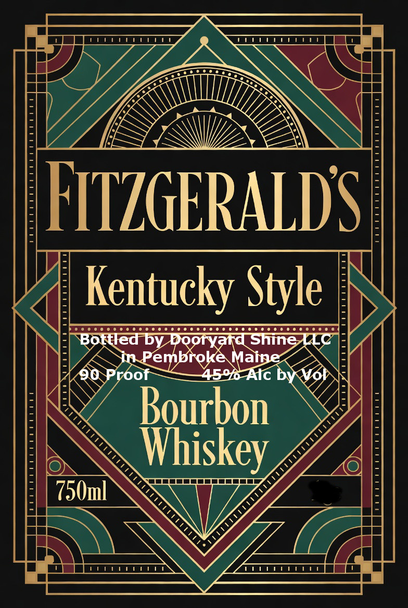

# TTB COLA Label Images - TTBID 26174001000924

**Brand Name:** FITZGERALD'S

**Fanciful Name:** KENTUCKY STYLE BOURBON WHISKEY

**Issue Date:** 07/02/2026

**Origin Code:** 24

**Product Class/Type:** 141

**Source:** [TTB Public COLA Registry](https://ttbonline.gov/colasonline/viewColaDetails.do?action=publicFormDisplay&ttbid=26174001000924)

## Label Images

### Back Label

### Label 1

## Extracted Label Text

*Text extracted via OCR - may contain errors*

**Detected Proof:** 90

### Back Label

Fitzgerald's Kentucky Style Bourbon
750ML
90 PROOF
ME
154
GOVERNMENT WARNING:
(1) According to the Surgeon
General;
women should not drink
alcoholic beverages because of
the risk of birth defects
(2) Consumption of alcoholic
616
beverages impairs your ability to
drive a car or operate machinery_
and may cause health problems_

### Label 1

Ce

REE h ee

ZEST

ATZGERALD

CXERUEER ERE EE EERE EERE ER EERE EERE

Kentucky ye

Rares

“750ml

Ntse

Te eT

AEURUENGESRF ETRE
