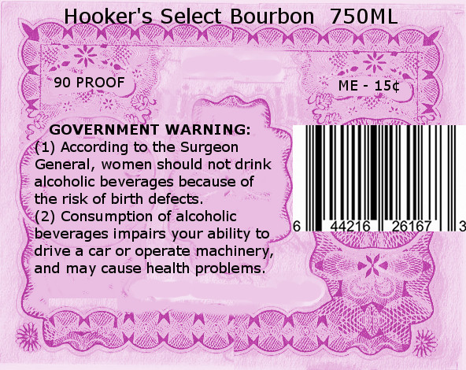
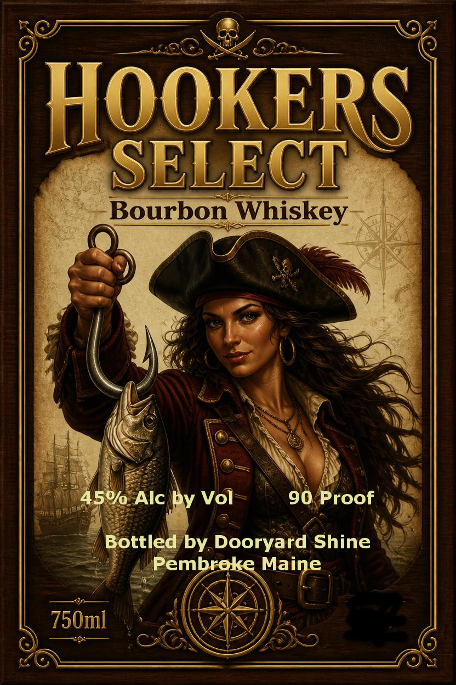

# TTB COLA Label Images - TTBID 26174001000927

**Brand Name:** HOOKERS BOURBON

**Issue Date:** 07/02/2026

**Origin Code:** 24

**Product Class/Type:** 141

**Source:** [TTB Public COLA Registry](https://ttbonline.gov/colasonline/viewColaDetails.do?action=publicFormDisplay&ttbid=26174001000927)

## Label Images

### Back Label

### Label 1

## Extracted Label Text

*Text extracted via OCR - may contain errors*

**Detected Proof:** 90

### Back Label

Hooker's Select Bourbon
750ML
90 PROOF
ME
154
GOVERNMENT WARNING:
(1) According to the Surgeon
General;
women should not drink
alcoholic beverages because of
the risk of birth defects
(2) Consumption of alcoholic
616
beverages impairs your ability to
drive a car or operate machinery_
and may cause health problems_

### Label 1

HOoKERS
SELECT
Bourbon Whiskey
450/0 Alc by Vol
90 Proof
Bottled by Dooryard Shine
Pembroke Maine
750m]
