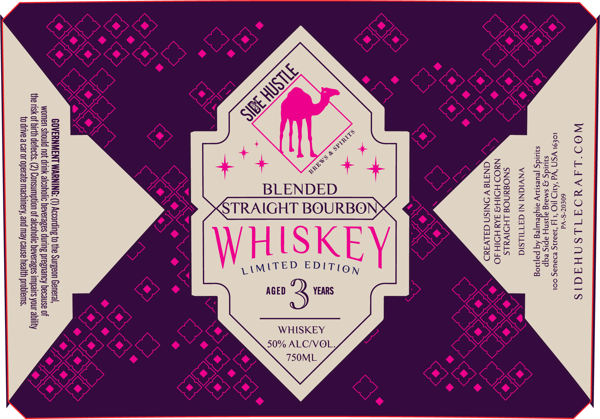

# TTB COLA Label Images - TTBID 26175001000018

**Brand Name:** SIDE HUSTLE BREWS & SPIRITS

**Issue Date:** 06/30/2026

**Origin Code:** 39

**Product Class/Type:** 121

**Source:** [TTB Public COLA Registry](https://ttbonline.gov/colasonline/viewColaDetails.do?action=publicFormDisplay&ttbid=26175001000018)

## Label Images

### Back Label

## Extracted Label Text

*Text extracted via OCR - may contain errors*

**Detected Proof:** 100

### Back Label

WOO'LAVAYOATILSNHAAIS
60€07-S-Vd
1Lo€9L Vd ‘A11D [10 ‘I 4 2aI5 eDaUaSg COL
siuidg g smaig ajisny apis eqp
siuidg jeuesnay arysewyjeg Aq pajog
VNVIGNI NI GATULSIG

SNO#dNOd LHOIVALS
NdaOD HOIH3 JAa HOIH JO
CN41d V ONISN G3ALVsaadD

WHISKEY
50% ALC/VOL,

ie

>
ELI é
Me
T:
=

GOVERNMENT WARNING: (1) According to the Surgeon General,
women should not drink alcoholic beverages during pregnancy because of
the risk of birth defects. (2) Consumption of alcoholic heverages impairs your ability
to drive a car or operate machinery, and may cause health problems.
