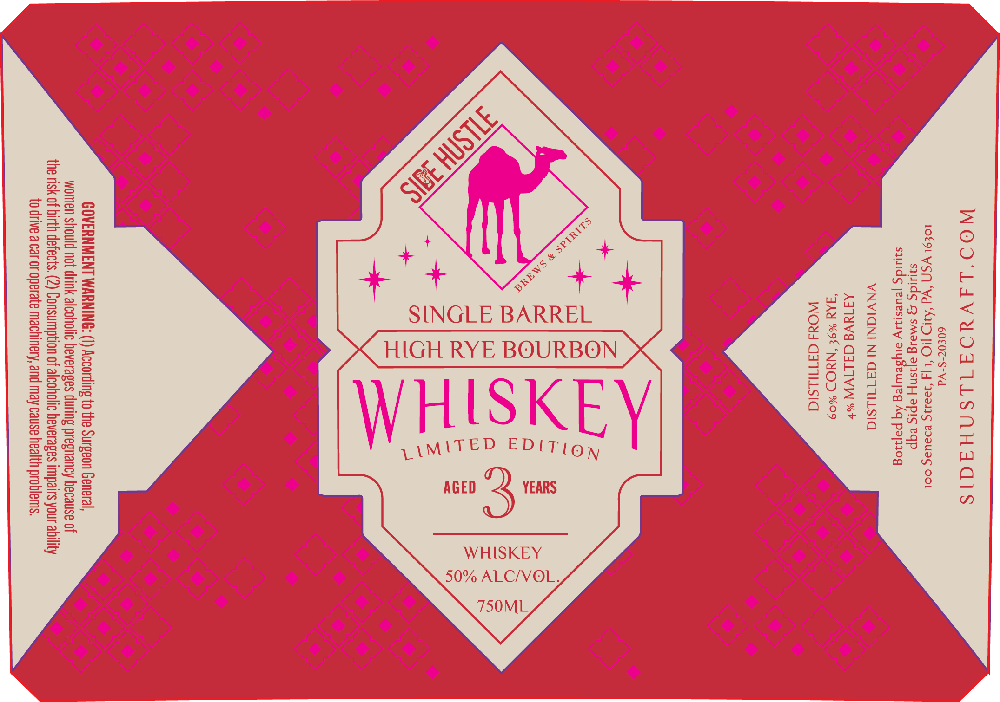

# TTB COLA Label Images - TTBID 26175001000021

**Brand Name:** SIDE HUSTLE BREWS & SPIRITS

**Issue Date:** 06/29/2026

**Origin Code:** 39

**Product Class/Type:** 141

**Source:** [TTB Public COLA Registry](https://ttbonline.gov/colasonline/viewColaDetails.do?action=publicFormDisplay&ttbid=26175001000021)

## Label Images

### Label 1

## Extracted Label Text

*Text extracted via OCR - may contain errors*

**Detected Proof:** 100

### Label 1

WOO 'LAVYOATLSNHAAIS
60£€07-S-Vd
LOE9L SN “Wd ‘AID I! ‘4 ass BDaUaS COL
suuidg g sMaig ajisny apis eqp
syuidg jeuesnay aiysewjeg Aq pajnog

VNVIGNI NI GaT1.Lsia
AaTaV G3ALIVW
FAY %9£ ‘NYOD %09
WOX4d G3TIILSIG

LAMLTED EDITI9y
WHISKEY
50% ALC/VOL,

S
| 2
=\5
lS
6 | 20
po} oo
—
S| ke
Z\/=x
Z|

=

WHISKEY

GOVERNMENT WARNING: (1) According to the Surgeon General,
women should not drink alcoholic beverages during pregnancy because of
the risk of birth defects. (2) Consumption of alcoholic beverages impairs your ability
to drive a car or operate machinery, and may cause health problems.
