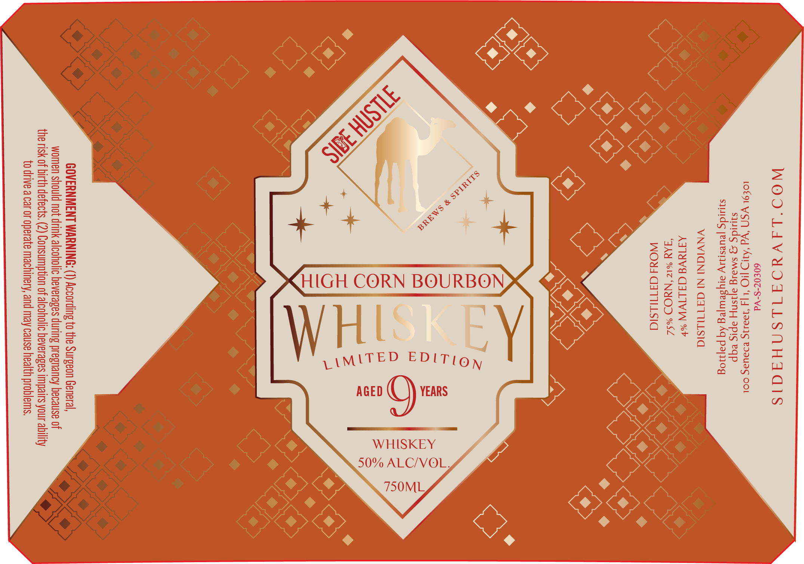

# TTB COLA Label Images - TTBID 26175001000022

**Brand Name:** SIDE HUSTLE BREWS & SPIRITS

**Issue Date:** 06/29/2026

**Origin Code:** 39

**Product Class/Type:** 141

**Source:** [TTB Public COLA Registry](https://ttbonline.gov/colasonline/viewColaDetails.do?action=publicFormDisplay&ttbid=26175001000022)

## Label Images

### Label 1

## Extracted Label Text

*Text extracted via OCR - may contain errors*

### Label 1

WOO'LIAVYOAILSNHAAIS
60€07-S-Vd
LOE9L YSN ‘Wd ‘AUD | |4 9241 BD3Uag COL
squids g sMaig ajisny apis eqp
syuidg peursiy aysewyeg Aq pajnog
VNVICNI NI GATULSIG

ALIVW %
NaOD %S2
WOdd G3ATIULSIG

om
3
WA
Z
=
S

GOVERNMENT WARNING: (1) According to the Surgeon General
women should not drink alcoholic beverages during pregnancy because of
the risk of birth defects, (2) Consumption of alcoholic beverages impairs your ability
to drive a car or operate machinery, and may cause health problems.
