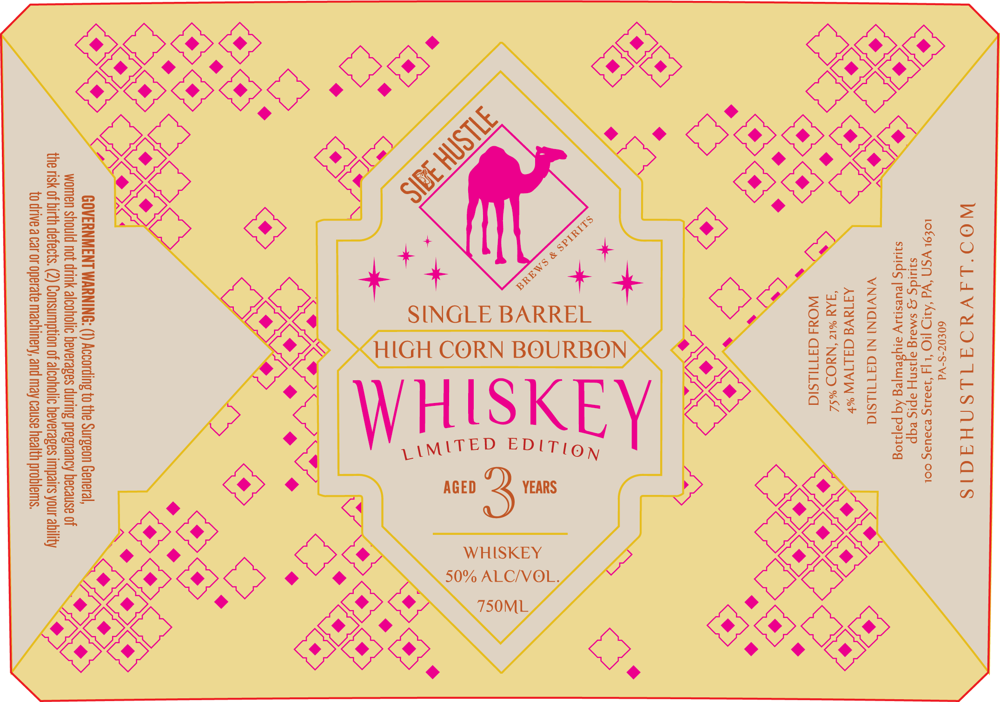

# TTB COLA Label Images - TTBID 26175001000023

**Brand Name:** SIDE HUSTLE BREWS & SPIRITS

**Issue Date:** 06/29/2026

**Origin Code:** 39

**Product Class/Type:** 141

**Source:** [TTB Public COLA Registry](https://ttbonline.gov/colasonline/viewColaDetails.do?action=publicFormDisplay&ttbid=26175001000023)

## Label Images

### Label 1

## Extracted Label Text

*Text extracted via OCR - may contain errors*

**Detected Proof:** 100

### Label 1

WOO'LAVYOATLSNHAAIS
60£07-S-Vd
LOE9L YSN “Wd ‘AID IO ‘L [4 39asG BDaUaS COL
siuidg g smaig ajisny apis eqp
squids jeuesniy aiysewjeg Aq pajiog
VNVIGNI NI GATULSIG

AdTaVE GALIVW %*
FAN %IZ “NYOD %S4
WOdd GATILsId

ey
S
a
~

O28

s
s

OK

LES

>
és
és
Ra
&

fry

oO
x,

SINGLE BARREL
WHISKEY
50% ALC/VOL,

S
co Zz
ee ©
=) be
= &
a iz
Zz fal
lad
S)Iae
=o z
OC BY
x=

>
aD,
Z
se
=
=>

GOVERNMENT WARNING: (1) According to the Surgeon General,
women should not drink alcoholic beverages during pregnancy because of
the risk of birth defects. (2) Consumption of alcoholic heverages impairs your ability
to drive a car or operate machinery, and may cause health problems.
