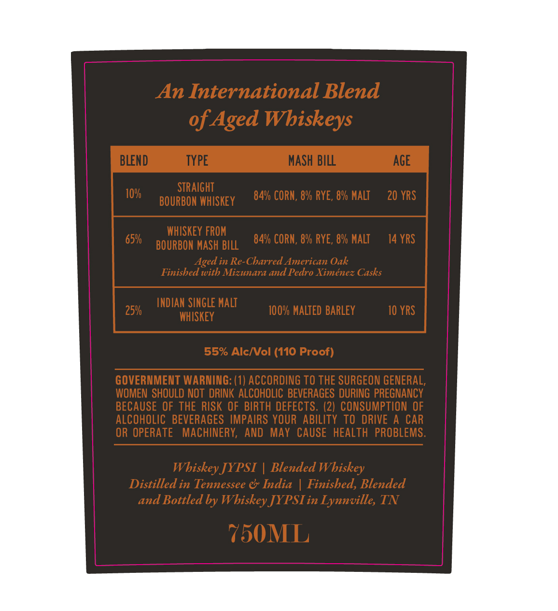
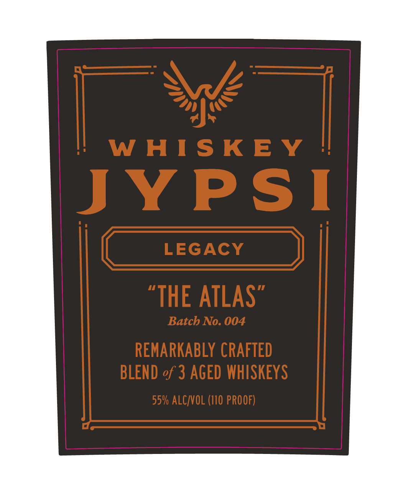

# TTB COLA Label Images - TTBID 26175001000199

**Brand Name:** WHISKEY JYPSI

**Fanciful Name:** LEGACY

**Issue Date:** 07/06/2026

**Origin Code:** 43

**Product Class/Type:** 137

**Source:** [TTB Public COLA Registry](https://ttbonline.gov/colasonline/viewColaDetails.do?action=publicFormDisplay&ttbid=26175001000199)

## Label Images

### Label 1

### Label 2

### Label 3

## Extracted Label Text

*Text extracted via OCR - may contain errors*

*1 image(s) excluded: text did not meet readability threshold*

**Detected Proof:** 110
**Detected Age:** 20 Years

### Label 1

An International Blend
of Aged Wbiskeys
BLEND
TYPE
MASH BILL
AGE
10%
STRAIGHT
84v CORN , 8% RYE, 8% MALT
20 YRS
BOURBON WHISKEY
WHISKEY FROM
65%/
84% CORN , 8% RYE , 8% MALT
14 YRS
BOURBON MaSh BILL
Aged in Re-Charred American Oak
Finished with Mizunara and Pedro Ximenez Casks
INDIAN SINGLE MalT
259/
100% MALTED BARLEY
10 YRS
WHISKEY
55% AlcMVol (110 Proof)
GOVERNMENT WARNING: (1) ACCORDING TO THE SURGEON GENERAL,
WOMEN  SHOULD NOT  DRINKALCOHOLIC BEVERAGES DURING PREGNANCY
BECAUSE OF THE RISK OF BIRTH DEFECTS. (2) CONSUMPTION OF
ALCOHOLIC   BEVERAGES   IMPAIRS YOUR   ABILITY TO DRIVE
CAR
OR OPERATE
MACHINERY; AND
MaY CAUSE   HEALTH   PROBLEMS.
Whiskey JYPSI
Blended Whiskey
Distilled in Tennessee & India
Finisbed, Blended
and Bottled by Wbiskey JYPSIin Lynnville, TN
750ML

### Label 2

W HIS K E Y
JYPSI
LEGAcY
"THE ATLAS
Batcb No. 004
REMARKABLY CRAFTED
BLEND of 3 AGED WHISKEYS
55% ALC VOL (I10 PROOF)
