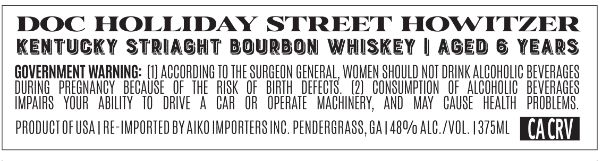
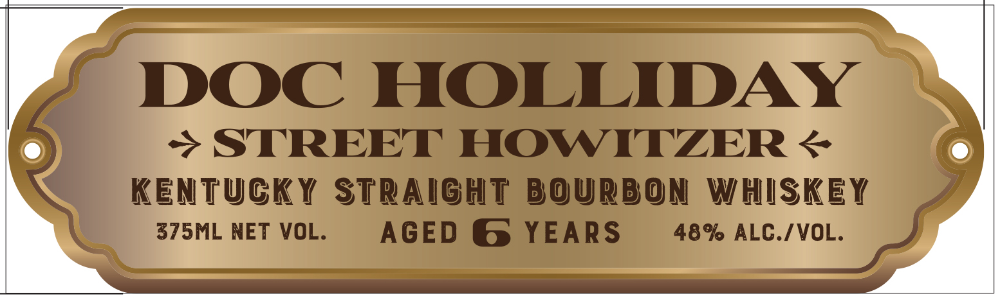

# TTB COLA Label Images - TTBID 26175001000224

**Brand Name:** DOC HOLLIDAY

**Issue Date:** 06/30/2026

**Origin Code:** 00

**Product Class/Type:** 101

**Source:** [TTB Public COLA Registry](https://ttbonline.gov/colasonline/viewColaDetails.do?action=publicFormDisplay&ttbid=26175001000224)

## Label Images

### Back Label

### Front Label

## Extracted Label Text

*Text extracted via OCR - may contain errors*

**Detected Proof:** 96
**Detected Age:** 6 Years

### Back Label

DOC HOLLIDAY STREET HOWITZER
Kentucky STRiaGhT Bourbon
WHISKEY
| AGEd 6 YEARS
GOVERNMENT WARNING: (11 ACCORDING TO THE SURGEON GENERAL, WOMEN SHOULD NOT DRINK ALcOhOLIc BEVERAGES
DURING  PREGNANCY  BECAUSE   OF_ THE  RISK   OF   BIRTH  DEFECTS
(21   CONSUMPTLON   OF   AlCohlC   BEVERAGES
IMPAIRS   YOUR   AbILITY   TO
DRIVE
A
CAR  OR   OPERATE   MACHINERY;
AND
May   CAUSE   HEALTH   PROBLEMS .
PRODUCT OF USA | Re-HMPORTED BY AVKO HMPORTERS INC. PENDERGRASS, GA |480/ AlC./VOL. /375ML
CACRV

### Front Label

DOC
HOLLIDAY
STREET HOWITZER &
KentuckY
Straight BoUrbON
WHISKEY
375ML NET VOL:
AGED
6 YEARS
48% ALC./VOL.
