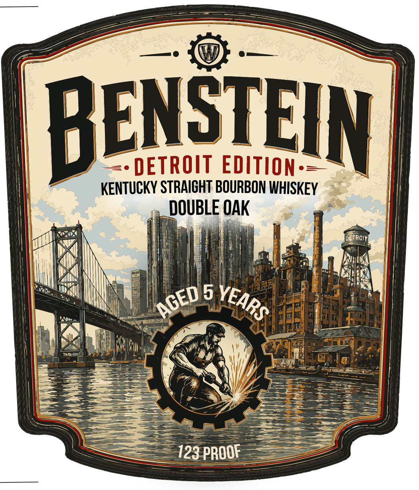
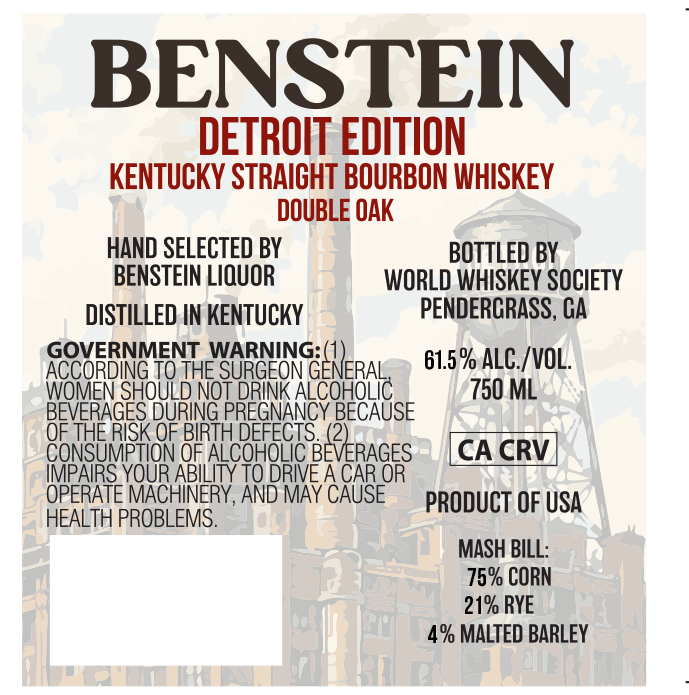

# TTB COLA Label Images - TTBID 26175001000289

**Brand Name:** BENSTEIN

**Issue Date:** 06/29/2026

**Origin Code:** 08

**Product Class/Type:** 101

**Source:** [TTB Public COLA Registry](https://ttbonline.gov/colasonline/viewColaDetails.do?action=publicFormDisplay&ttbid=26175001000289)

## Label Images

### Back Label

### Front Label

## Extracted Label Text

*Text extracted via OCR - may contain errors*

**Detected Proof:** 123

### Back Label

BENSTEIN
DETROIT EDITION =
KENTUCKY STRAICHT BOURBON WHISKEY
DOUBLE OAK
OGDROIT
5
PROOF
VEARS
AGED
123

### Front Label

BENSTEIN
DETROIT EDITION
KENTUCKY STRAICHT BOURBON WHISKEY
DOUBLE OAK
HAND SELECTED BY
BOTTLED BY
BENSTEIN LIQUOR
WORLD WHISKEY SOCIETY
DISTILLED IN KENTUCKY
PENDERCRASS, CA
GOVERNMENT WARNING: (1
61.5 % ALC /VOL.
ACCORDING TO THE SURGEON GENERAL
WOMEN SHOULD NoT DRINK ALC
CoHolic
750 ML
PREGNANCY BECAUSE
8e94555,043156
THE RISK OF BIRTH DEFECTS.
CONSUMPTION OF ALCOHOLic
BEPERAGES
CA CRV
IMPAIRS_YOUR ABILITY TO DRIVE A CAR_OR
OPERATE MACHINERY, AND MAY CAUSE
PRODUCT OF USA
HEALTH PROBLEMS.
MASH BILL:
75% CORN
21% RYE
% MALTED BARLEY
