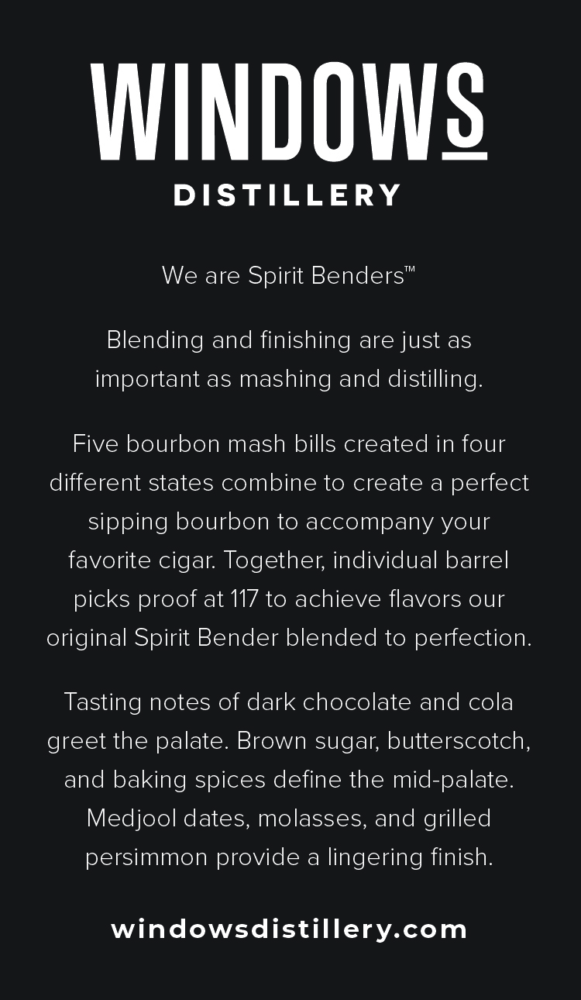
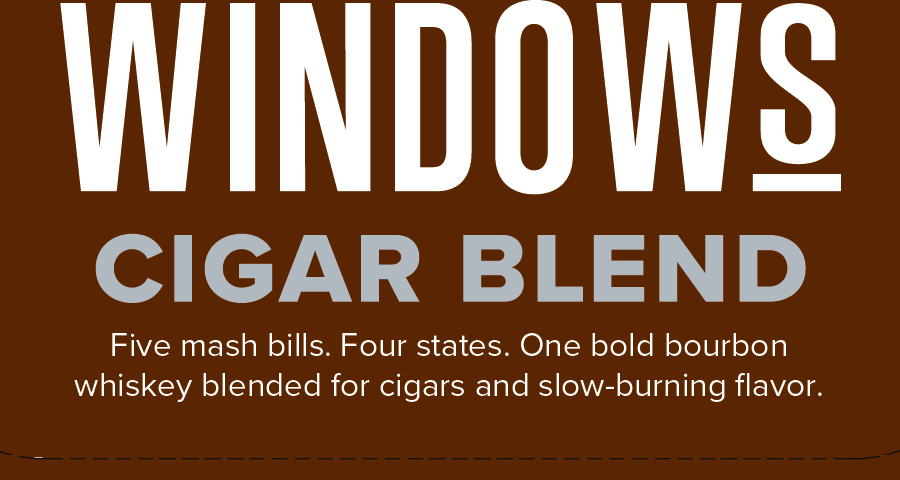

# TTB COLA Label Images - TTBID 26175001000362

**Brand Name:** WINDOWS DISTILLERY CIGAR BLEND

**Issue Date:** 07/22/2026

**Origin Code:** 04

**Product Class/Type:** 121

**Source:** [TTB Public COLA Registry](https://ttbonline.gov/colasonline/viewColaDetails.do?action=publicFormDisplay&ttbid=26175001000362)

## Label Images

### Back Label

### Front Label

## Extracted Label Text

*Text extracted via OCR - may contain errors*

### Back Label

WINDOWS

DISTILLERY

We are Spirit Benders

™

Blending and finishing are just as

important as mashing and distilling

Five bourbon mash bills created in four

different states combine to create a perfect

sipping bourbon to accompany your

favorite cigar. Together, individual barrel

picks

roof at 117 to achieve flavors our

original Spirit Bender

lended to perfection

Tasting notes of dark chocolate and cola

greet the palate. Brown sugar, butterscotch,

and baking spices define the mid-palate.

Medjool dates, molasses, and grilled

persimmon provide a lingering finish.

windowsdistillery.com

### Front Label

WINDOWS

CIGAR BLEND

Five mash bills. Four states. One bold bourbon

whiskey blended for cigars and slow-burning flavor.
