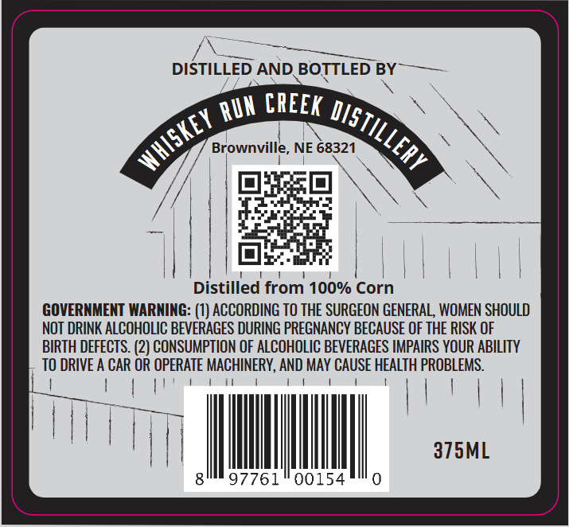
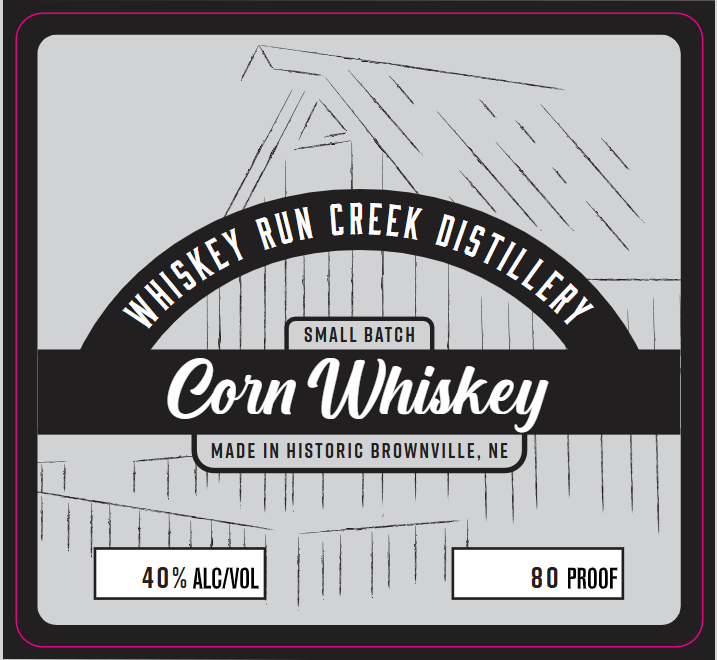

# TTB COLA Label Images - TTBID 26175001000383

**Brand Name:** WHISKEY RUN CREEK DISTILLERY

**Issue Date:** 06/29/2026

**Origin Code:** 31

**Product Class/Type:** 143

**Source:** [TTB Public COLA Registry](https://ttbonline.gov/colasonline/viewColaDetails.do?action=publicFormDisplay&ttbid=26175001000383)

## Label Images

### Back Label

### Front Label

## Extracted Label Text

*Text extracted via OCR - may contain errors*

**Detected Proof:** 80

### Back Label

DISTILLED AND BOTTLED BY
CREEK
Brownville
NE 68321
Distilled from 100% Corn
GOVERNMENT WARNING: (1) ACCORDING TO THE SURGEON GENERAL, WOMEN SHOULD
NOT DRINK ALCOHOLIC BEVERAGES DURING PREGNANCY BECAUSE OF THE RISK OF
BIRTH DEFECTS. (2) CONSUMPTION OF ALCOHOLIC BEVERAGES IMPAIRS YOUR ABILITY
TO DRIVE A CAR OR OPERATE MACHINERY, AND MAY CAUSE HEALTH PROBLEMS.
375ML
97761
00154
RUN
DISTILLERY
whiSkey

### Front Label

CREEk
SMALL BATCH
Co Uhiskey
MADE IN HISTORIC BROWNVILLE, NE
40 % ALCIVOL
80 PROOF
RUN
DISTILLERY
whISkEY
