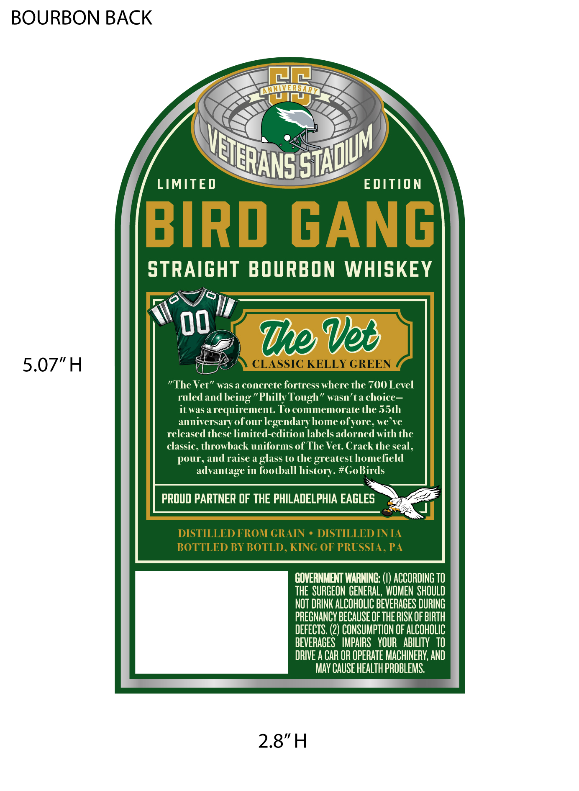
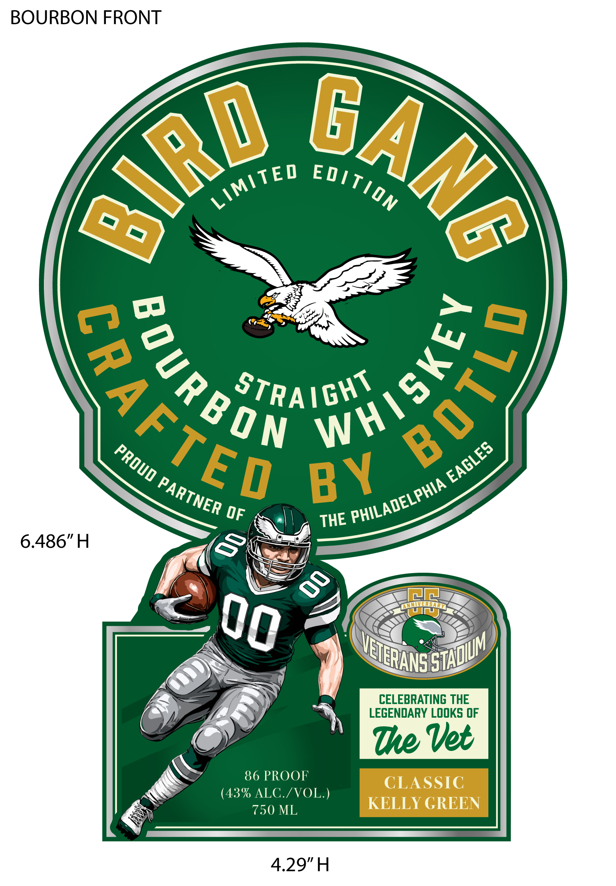

# TTB COLA Label Images - TTBID 26175001000395

**Brand Name:** BIRD GANG SPIRITS

**Issue Date:** 06/29/2026

**Origin Code:** 39

**Product Class/Type:** 101

**Source:** [TTB Public COLA Registry](https://ttbonline.gov/colasonline/viewColaDetails.do?action=publicFormDisplay&ttbid=26175001000395)

## Label Images

### Back Label

### Front Label

## Extracted Label Text

*Text extracted via OCR - may contain errors*

**Detected Proof:** 86

### Back Label

BOURBON BACK
iAM
U
LIMITED
EDITION
BIRD
GANG
STRAIGHT BOURBON WHISKEY
7e Ved
5.07"H
CLASSIC KELLY CREEN
"The Vet" was a concrete fortress where the 700 Level
ruled and
being'
Philly Tough"
wasn'ta choice _
itwasa requirement: To commemorate the 55th
anniversary ofourlegendary home
we ve
released these limited-edition labels adorned with the
classic, throwback uniforms of The Vet. Crack the seal,
pour
andraise a glass to the greatest homefield
advantage in football history. #GoBirds
PROUD PARTNER OF THE PHILADELPHIA EAGLES
DISTILLED FROM GRAIN
DISTILLED INIA
BOTTLED BY BOTLD, KING OF PRUSSIA , PA
COVERNMENT WARNING;
ACCORDING TO
THE SURGEON GENERAL, WOMEN  SHOULD
NOT DRINK ALCOHOLIC BEVERAGES DURING
PREGNANCY BECAUSE OF THE RISK OF BIRTH
DEFECTS: (2) CONSUMPTION OF ALCOHOLIC
BEVERAGES   IMPAIRS   YOUR   ABILITY   TO
DRIVE A CAR OR OPERATE MACHINERY; AND
MaY CAUSE HEALTH PROBLEMS.
2.8"H
VEIIERANSE
STADUM
ofyore;

### Front Label

BOURBON FRONT
STRAIGHT
OF
6.486"H
NINA
CELEBRATING THE
LEGENDARY LOOKS OF
Te Vet
86 PROOF
CLASSIC
(43% ALC /VOL.)
750 ML
KELLY GREEN
4.29"H
BAnG
@ird
LIMiTED
ED/TION
)
80UR BON
3
0
EAGLES
PROUD
BY
PARTNER
PHILADELPHIA
THE
8
00
VEIIERANS=
STADUM
