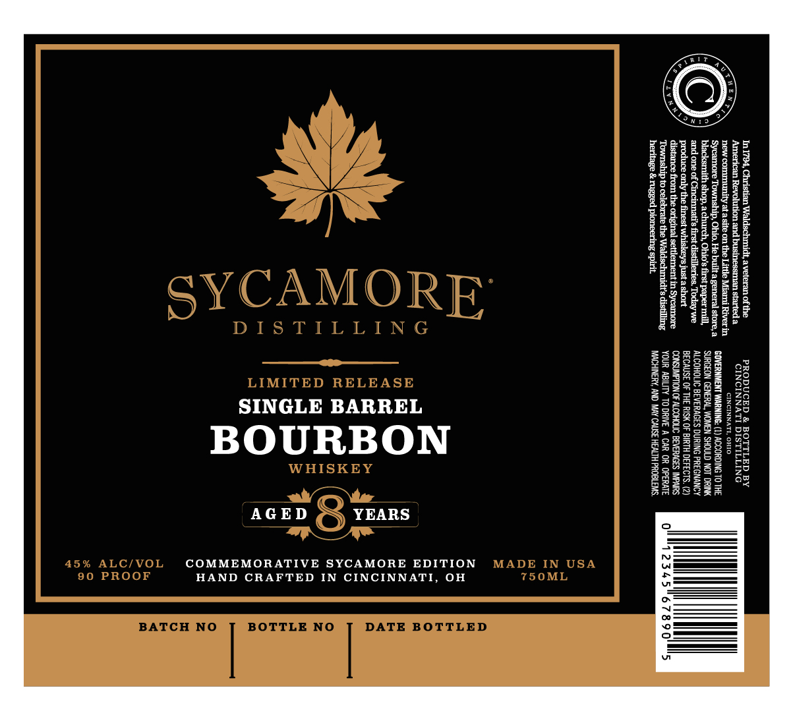

# TTB COLA Label Images - TTBID 26175001000404

**Brand Name:** SYCAMORE DISTILLING

**Fanciful Name:** SINGLE BARREL BOURBON WHISKEY

**Issue Date:** 07/24/2026

**Origin Code:** 09

**Product Class/Type:** 101

**Source:** [TTB Public COLA Registry](https://ttbonline.gov/colasonline/viewColaDetails.do?action=publicFormDisplay&ttbid=26175001000404)

## Label Images

### Label 1

## Extracted Label Text

*Text extracted via OCR - may contain errors*

### Label 1

2

i

1

Pad

gee

Hil

58

ae

8

He

Ee

Bee

if

Ba

all

i

2S

on

SINGLE BARREL

A dal rene

Bri

BS

AGED YEARS

COMMEMORATIVE SYCAMORE EDITION

HAND CRAFTED IN CINCINNATI, OH
