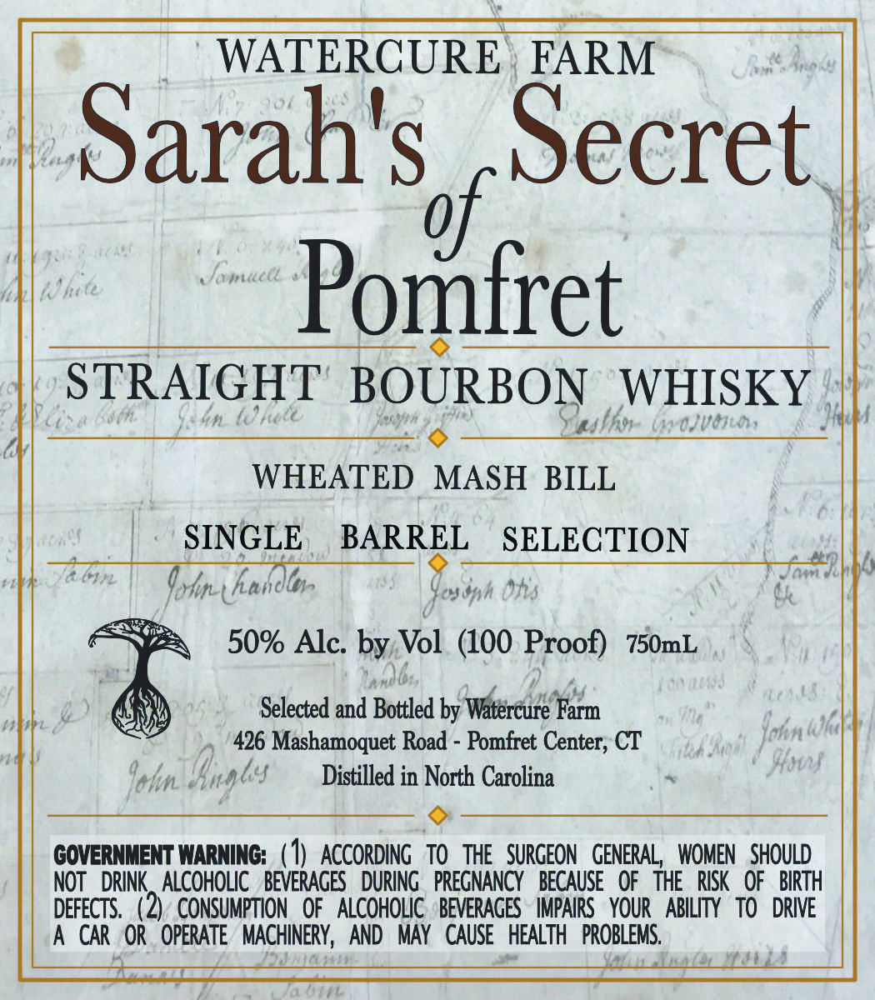

# TTB COLA Label Images - TTBID 26175001000439

**Brand Name:** WATERCURE FARM

**Fanciful Name:** SARAHS SECRET OF POMFRET

**Issue Date:** 07/08/2026

**Origin Code:** 14

**Product Class/Type:** 101

**Source:** [TTB Public COLA Registry](https://ttbonline.gov/colasonline/viewColaDetails.do?action=publicFormDisplay&ttbid=26175001000439)

## Label Images

### Label 1

## Extracted Label Text

*Text extracted via OCR - may contain errors*

**Detected Proof:** 100

### Label 1

WATERCURE
FARM
J;
Sarahs
Secret
1~
amac
Pomfret
STRAIGHT
BOURBON
WHISKY
{ 6s6n
7kn (ORee
ubat
0jvto,
WHEATED
MASH BILL
SINGLE
BARREL
SELECTION
Jatm
Ashn-( hanotor
Ohs
O
Gossph =
50% Alc: by Vol (100 Proof)
750mL
V_
7
"Io'U
Selected and Bottled by Watercure Farm
426 Mashamoquet Road
Pomfret Center; CT
Jokn (k|
Ichn- Gnnlss
Distilled in North Carolina
Slsos
GOVERNMENT WARNING: ( 1) AccoRding   to THE   SURGEON   GENERAL   WOMEN   SHOUld
NOT   DRInk   AlCoholic   BEVERAGES   During   PReGNANcy   BECAUSE  Of THE   RISk   OF   BIRTH
DEFECTS.  (2)  CONSUMPTION
OF   ALCOHOLIC   BEVERAGES   IMPAIRS   YOUR   ABILITy   TO
DRIVE
A CAR OR   OPERATE   MACHINERY,  AND   MAY   CAUSE   HEALTH   PROBLEMS.
0 hte
