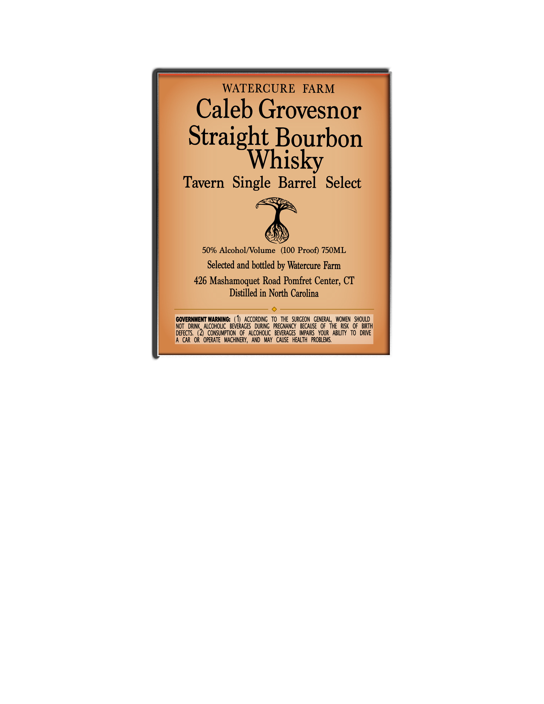

# TTB COLA Label Images - TTBID 26175001000457

**Brand Name:** WATERCURE FARM

**Fanciful Name:** CALEB GROVESNOR TAVERN SELECT

**Issue Date:** 07/07/2026

**Origin Code:** 14

**Product Class/Type:** 101

**Source:** [TTB Public COLA Registry](https://ttbonline.gov/colasonline/viewColaDetails.do?action=publicFormDisplay&ttbid=26175001000457)

## Label Images

### Label 1

## Extracted Label Text

*Text extracted via OCR - may contain errors*

**Detected Proof:** 100

### Label 1

WATERCURE
FARM
Caleb Grovesnor
Straight Bourbon
Whisky
Tavern   Single Barrel
Select
50% Alcohol/Volume   (100 Proof) 750ML
Selected and bottled by Watercure Farm
426 Mashamoquet Road Pomfret Center; CT
Distilled in North Carolina
GOVERNMENT WARNING:
AccoRdiNG   to  the   SURGEON   GENERAL,  WOMEN   SHOULD
NOT
drInk   ALCOhOLIC   BEVERAGES   DURIng   PREGNANCY   BECAUSE   Of   the   RISK   OF   BRTH
DEFECTS ,  (2)  CONSUMPTION   oF   Alcoholic   BEVERAGES   IMPAIRS   YOUR   ABILITy   to   DRIVE
CAR  OR   OPERATE   MACHINERY,  AND   MAY   CAUSE   HEALTH   PROBLEMS.
