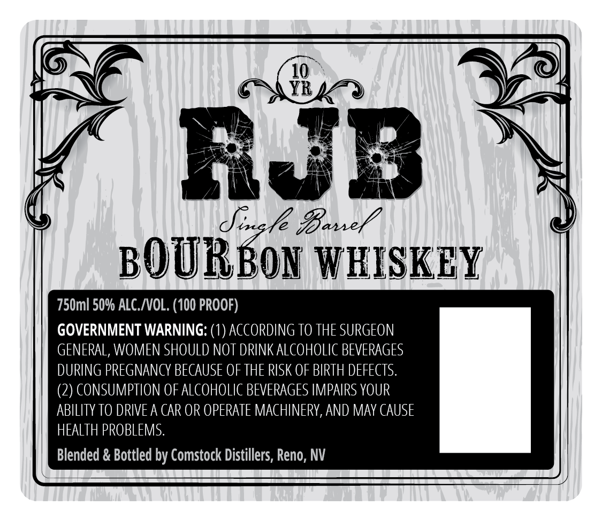
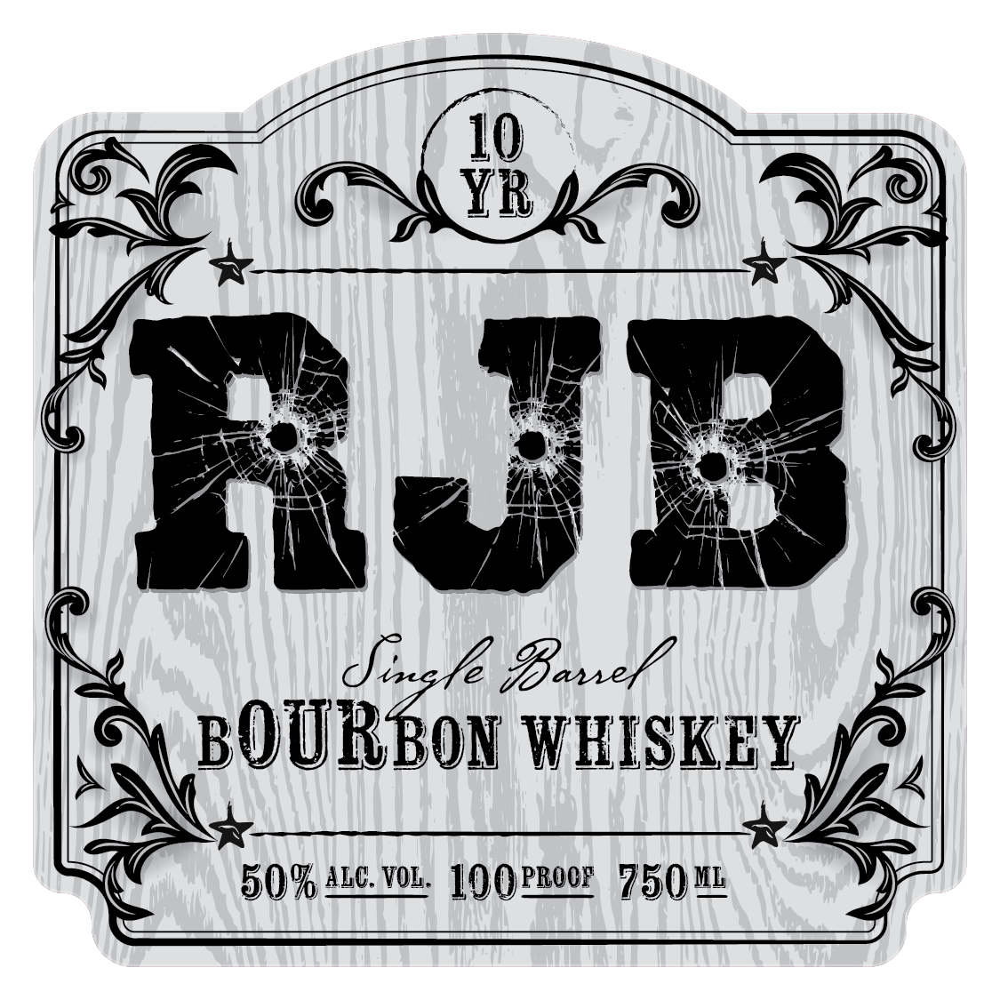

# TTB COLA Label Images - TTBID 26175001000570

**Brand Name:** RJB BOURBON WHISKEY

**Issue Date:** 07/01/2026

**Origin Code:** 32

**Product Class/Type:** 141

**Source:** [TTB Public COLA Registry](https://ttbonline.gov/colasonline/viewColaDetails.do?action=publicFormDisplay&ttbid=26175001000570)

## Label Images

### Back Label

### Front Label

## Extracted Label Text

*Text extracted via OCR - may contain errors*

*1 image(s) excluded: text did not meet readability threshold*

**Detected Proof:** 100
**Detected Age:** 10 Years

### Back Label

10
YR
R3b
Jisle %Baxel
BOURBON WISKEY
750ml 50% ALC_NOL. (100 PROOF)
GOVERNMENT WARNING: (1_
ACCORDING TO THE SURGEON
GENERAL, WoMEN SHOULD NOT DRINK ALCOHOLIc BEVERAGES
DURING PREGNANCY BECAUSE OF THE RISK OF BIRTH DEFECTS:
(2) CONSUMPTION OF ALCOHOLIC BEVERAGES IMPAIRS YOUR
ABILITY TO DRIVEA CAR OR OPERATE MACHINERY, AND MAY CAUSE
HEALTH PROBLEMS.
Blended & Bottled by Comstock Distillers, Reno, NV
