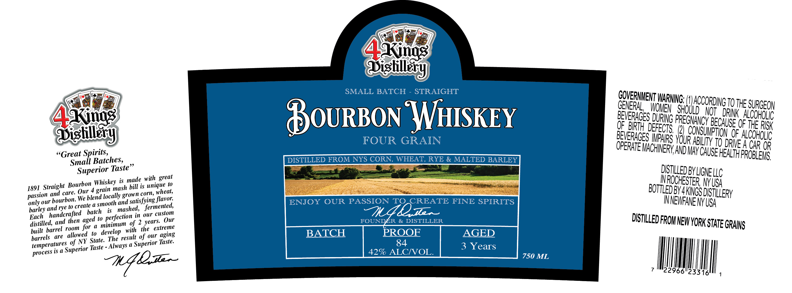

# TTB COLA Label Images - TTBID 26175001000600

**Brand Name:** 4 KINGS DISTILLERY

**Issue Date:** 07/09/2026

**Origin Code:** 02

**Product Class/Type:** 101

**Source:** [TTB Public COLA Registry](https://ttbonline.gov/colasonline/viewColaDetails.do?action=publicFormDisplay&ttbid=26175001000600)

## Label Images

### Label 1

## Extracted Label Text

*Text extracted via OCR - may contain errors*

**Detected Age:** 3 Years

### Label 1

Axings
Dislllay)
SMALL BATCH
STRAIGHT
SErwe
OEHG OACCORDIGjothe SURGEOV
4xing;
BouRBOn WHISKEY
{e32Bmergerh
Qe BRTH defects ' (21
OF THE RISK
Dislilsy
FOUR GRAIN
853DE3 &oaaun i9 Idehgr &
Spirits,_
OPERateMAcHeRk AndHay GaUSEHezhEFROBEg
sGreat
Batches,
DISTILLED FROM NYS CORN, WHEAT; RYE & MALTED BARLEY
{PROBLeMS,
Smail _
Superior Taste
DSTILLeDBYLIGNELLC
Bourbon Whiskey is"ades utiqgeeco
WROCHESTER W USa ^
1891 oStraighcaRouonon
7ashOll cOrmigheac
BOTTLEDETKKcSdSfilerv
only our
"o_cbo reabie smocah a ndoatsfSng "iated
ENJOY OUR PASSION
TO
CREATE FINE SPIRITS
WNEWFANE NUSa
barley and rye to create &
is
mashed;,  fermented,
7O@
haadarafeed <
bacl perfecaonei; %
Our
FOUNDER & DISTILLER
DISTIlled FROMNEWYORK =
distilled,
room  for
minimum of 2
extreme
(STATE GRAINS
buill bartel radowea
to   develop
with
the
aging
BATCH
PROOF
AGED
barrels   are
NY State. The
of
Taste_
temperatures %
Taste
Always a
Superior
84
3 Years
is a
Superior
429 ALCIVOL.
750 ML
22966123318
great
grain
and
passion
custom
Each
aged
and
years:
our
result
process
74Dz
