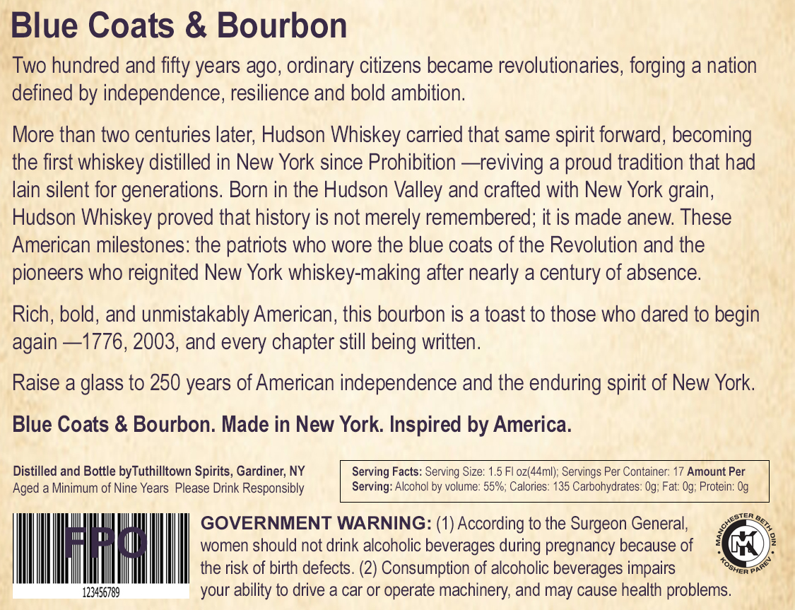

# TTB COLA Label Images - TTBID 26175001000617

**Brand Name:** HUDSON WHISKEY

**Fanciful Name:** BLUE COATS & BOURBON

**Issue Date:** 06/30/2026

**Origin Code:** 02

**Product Class/Type:** 101

**Source:** [TTB Public COLA Registry](https://ttbonline.gov/colasonline/viewColaDetails.do?action=publicFormDisplay&ttbid=26175001000617)

## Label Images

### Front Label

## Extracted Label Text

*Text extracted via OCR - may contain errors*

### Front Label

Blue Coats & Bourbon
Two hundred and
years ago, ordinary citizens became revolutionaries; forging a nation
defined by independence, resilience and bold ambition;
More than two centuries later; Hudson Whiskey carried that same spirit forward, becoming
the first whiskey distilled in New York since Prohibition ~ reviving a proud tradition that had
lain silent for generations. Born in the Hudson Valley and crafted with New York grain,
Hudson Whiskey proved that history is not merely remembered; it is made anew: These
American milestones: the patriots who wore the blue coats of the Revolution and the
pioneers who reignited New York whiskey-making after nearly a century of absence.
Rich; bold, and unmistakably American, this bourbon is a toast to those who dared to begin
again -1776, 2003, and every chapter still being written.
Raise a glass to 250 years of American independence and the enduring spirit of New York:
Blue Coats & Bourbon: Made in New York Inspired by America:
Distilled and Bottle byTuthilltown Spirits, Gardiner; NY
Serving Facts: Serving Size: 1.5 Fl oz(44ml); Servings Per Container: 17 Amount Per
Aged a Minimum of Nine Years Please Drink Responsibly
Serving: Alcohol by volume: 55%; Calories: 135 Carbohydrates: Og; Fat: Og; Protein: Og
GOVERNMENT WARNING: (1) According to the Surgeon General;
women should not drink alcoholic beverages during pregnancy because of
the risk of birth defects. (2) Consumption of alcoholic beverages impairs
123456789
your ability to drive a car or operate machinery; and may cause health problems
fifty
ester
Jbetk _
tosher `
