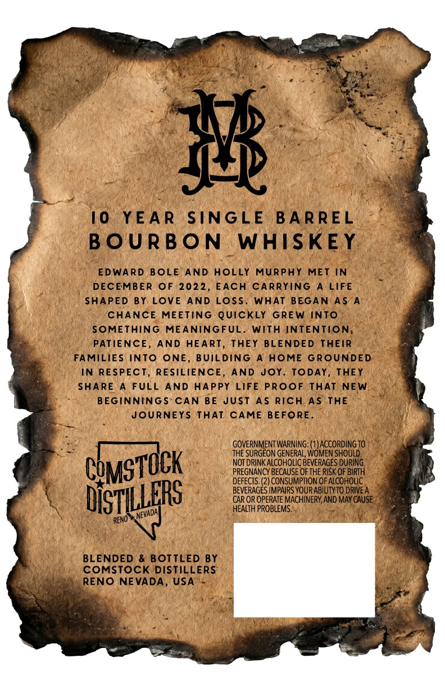
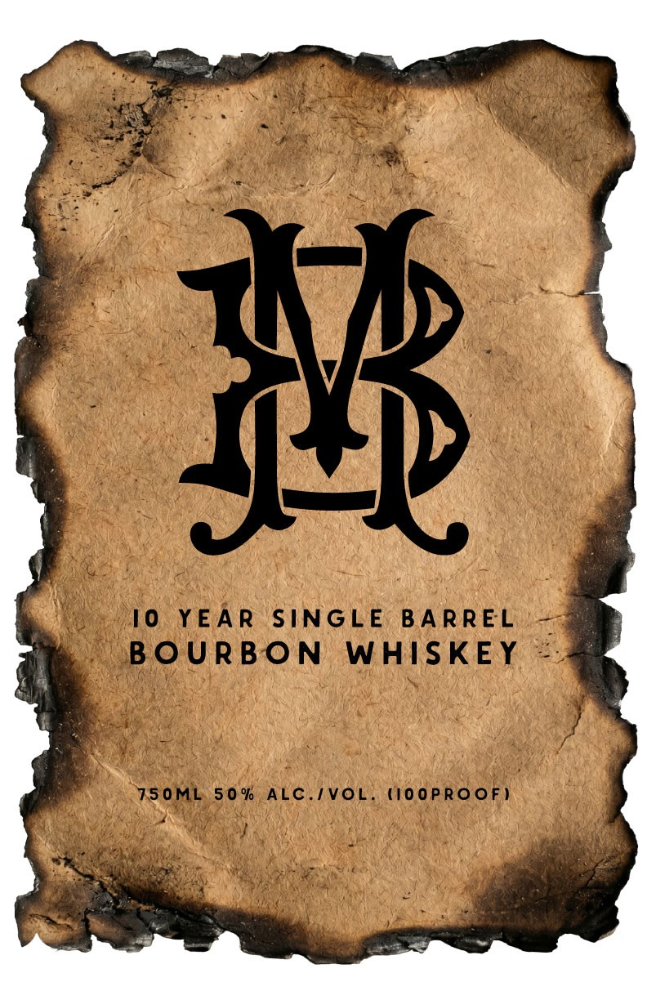

# TTB COLA Label Images - TTBID 26175001000655

**Brand Name:** BM BOURBON WHISKEY

**Issue Date:** 07/01/2026

**Origin Code:** 32

**Product Class/Type:** 141

**Source:** [TTB Public COLA Registry](https://ttbonline.gov/colasonline/viewColaDetails.do?action=publicFormDisplay&ttbid=26175001000655)

## Label Images

### Back Label

### Front Label

## Extracted Label Text

*Text extracted via OCR - may contain errors*

*1 image(s) excluded: text did not meet readability threshold*

### Back Label

#
10
YEA R
SINGLE
B A R REL
B OURBON
WHISKEY
EDWARD
BOLE AND HOLLY
MURPhY
MET IN
DECEMBER
OF 2022, EACH
CARRYING
A LIFE
SHAPED BY LOvE
AND Loss
WHAT BEGAN As
CHANCE
MEETinG Quickly
GREW InTO
SOMETHING
MEANINGFUL.
With INTENTION,
PATIENCE,
AND HEART, THEY BLENDED ThEIR
FAMILIES INTO
ONE, BUiLDING
HOME GROUNDED
IN RESPECT_
RESILIENCE,
AND Joy
TODAY, THEY
SHARE
FULL
AND HAPPY LIFE Proof THAT NEW
BEGINNINGS  CAN BE JUsT AS Rich As THE
JOURNEYS THAT CAME BEFORE.
GOVERNMENT WARniNG: ( )ACCORDINGTO
THE SURGEON GENERAL, WOMEN SHOULD
NOT DRINK ALCOHOLIC BEVERAGES DURING
PREGNANCY BECAUSE OF THE RISK OF BIRTH
DEFECTS: (2) CONSUMPTION OF ALCOHOLIC
BEVERAGES IMPAIRS YOURABILITYTO DRIVEA
DiSTLERS
CAR OR OPERATE MACHINERY,AND MAY CAUSE
HEALTH PROBLEMS:
RENO
BLENDED
& BOTTLED BY
COMSTock DISTILLERS
RENO NEVADA, USA
CQMSTOCK
{NEVADA
