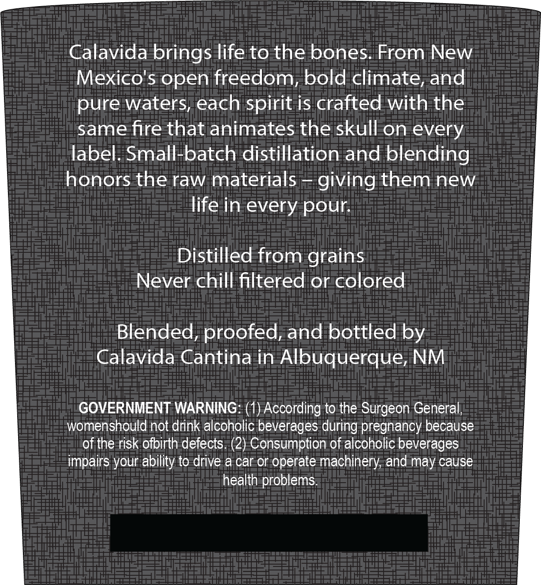
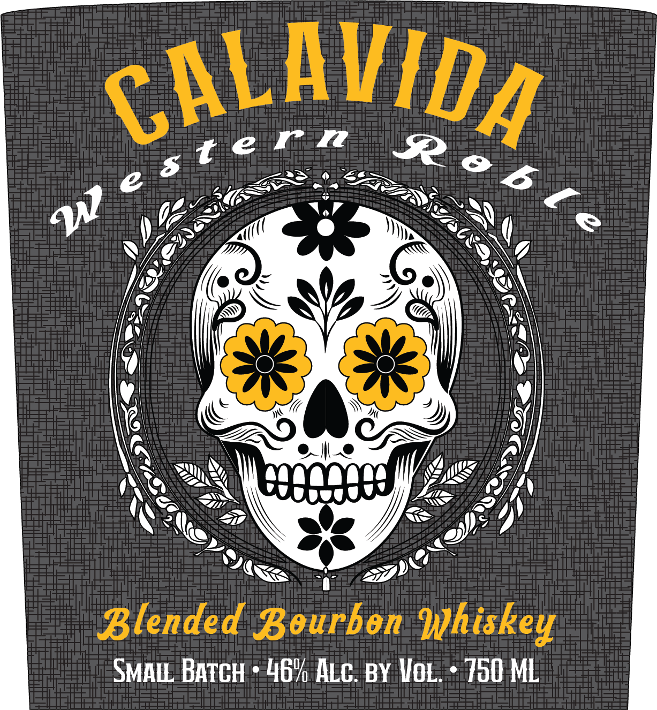

# TTB COLA Label Images - TTBID 26176001000009

**Brand Name:** WESTERN ROBLE

**Issue Date:** 07/07/2026

**Origin Code:** 34

**Product Class/Type:** 131

**Source:** [TTB Public COLA Registry](https://ttbonline.gov/colasonline/viewColaDetails.do?action=publicFormDisplay&ttbid=26176001000009)

## Label Images

### Back Label

### Front Label

## Extracted Label Text

*Text extracted via OCR - may contain errors*

### Back Label

Calavida brings life to the bones:
From New
Mexico's open freedom
bold climate; and
pure waters;each
is crafted with the
same fire that animates the skull on every
Iabel. Small-batch distillation and blending
honors the raw materials
giving them new
life in every pour:
Distilled from grains
Never chill filtered or colored
Blended; proofed; and bottled
Calavida Cantina in
Albuquerque; NM
GOVERNMENT WARNING: (1) According to the Surgeon General;
womenshould not drink alcoholic beverages during pregnancy because
of the risk ofbirth defects:(2) Consumption of alcoholic beverages
impairs your
to drive a car or operate machinery; and may cause
health problems
spirit
by
ability

### Front Label

CALAVIDA
Blended Bourbon Hhiskey
SMALL BATcH
46v ALcBY VoL:
750 ML
w e $term
R"6 [ 2
