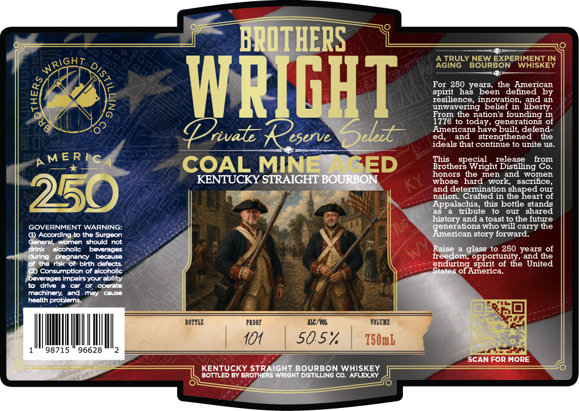

# TTB COLA Label Images - TTBID 26176001000155

**Brand Name:** PRIVATE RESERVE SELECT

**Issue Date:** 06/30/2026

**Origin Code:** 22

**Product Class/Type:** 101

**Source:** [TTB Public COLA Registry](https://ttbonline.gov/colasonline/viewColaDetails.do?action=publicFormDisplay&ttbid=26176001000155)

## Label Images

### Label 1

## Extracted Label Text

*Text extracted via OCR - may contain errors*

### Label 1

BROTHERS
GH
AGIRULY BOUREORERIESKEN
BOURBON
WHISKEY
WRIGHT
FpinZBQagedeenhdetmezicay
4
resllience, innovation,
lbeItyn
unwavering
belief in
rom the nation'S founding in
776
today, generations of
Americans have built; defend
Urivalz
eserve
Select
and
strengthened
the
ideals that continue to unite uS_
AMERTC
COAL MINE SED
This
Ehotherpeviaght
release
Bealingreot
honors the men and
womlen
KENTUCKY STRAIGHT BOURBON
whose   hard
work,   sacrifce
250
aadcleteraliteation
Hleapearo
?1
Appalachia
this bottle stands
tbute
our
shared
history and
toast to the future
GOVERNMENT WARNING:
Jenezctontc
who will cany the
() According t0 the Surgeon
story forward:
General
worenshould not
drnk
elcohollc
Dovorado
Raise
glass to 250 years of
durng
Gnednangy
bacause
freedom; opportunity_
and the
the
Hsk or birth defects
enduring_spirit of the United
() Consumpton Of alcoholic
of America:
beverages impairs your ability
drive
operate
machinery_and
may
Caus
health problerns
BOITLE
PROOE
MC/YOL
TOLQHE
10
5057
750mL
98715
96628
SCAN FOR MORE
KENTUCKY STRAIGHT BOURBON WHISKEY
BOTTLED By BrotheRS Wright DIStILLING Co. AFLEX KY
WRIC
