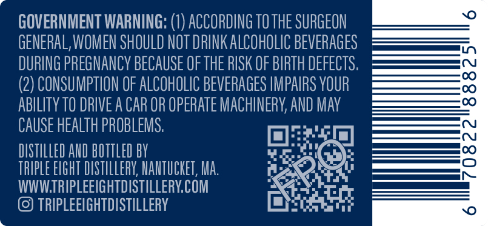
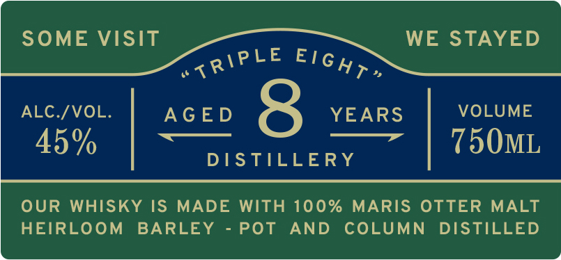
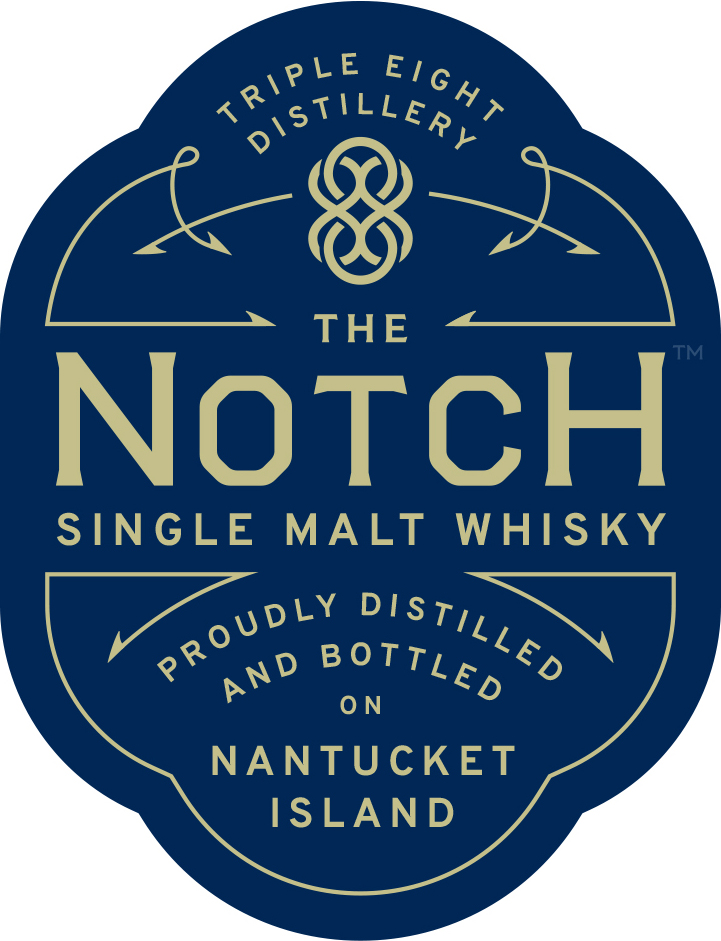

# TTB COLA Label Images - TTBID 26176001000250

**Brand Name:** NOTCH

**Issue Date:** 07/07/2026

**Origin Code:** 26

**Product Class/Type:** 118

**Source:** [TTB Public COLA Registry](https://ttbonline.gov/colasonline/viewColaDetails.do?action=publicFormDisplay&ttbid=26176001000250)

## Label Images

### Back Label

### Front Label

### Label 1

### Label 3

## Extracted Label Text

*Text extracted via OCR - may contain errors*

*1 image(s) excluded: text did not meet readability threshold*

**Detected Proof:** 90

### Back Label

GOVERNMENT WARNING:
ACCORDING TO THE SURGEON
GENERAL, WOMEN SHOULD NOT DRINKALCOHOLIC BEVERAGES
DURING PREGNANCY BECAUSE OF THE RISK OF BIRTH DEFECTS;
(2) CONSUMPTION OF ALCOHOLIC BEVERAGES IMPAIRS VOUR
3
ABILITy TO DRIVE A CAR OR OPERATE MACHINERY AND MAy
CAUSE HEALTh PROBLEMS:
DISTILLED AlD BOTTLED bV
3
TbIpLe EIGHT DISTILLERV; MANTUCKET, Ma:
WWWTRIPLEEIGHTDISTILLERYCOM
TRIPLEEIGHTDISTILLERY

### Front Label

@

~

SOME VISIT aire El6y~ WE STAYED

ALC./VOL.

AGED

YEARS

VOLUME

=——

——

45%

DISTILLERY

750ML

OUR WHISKY IS MADE WITH 100% MARIS OTTER MALT

HEIRLOOM BARLEY - POT AND COLUMN DISTILLED

### Label 1

0'STiLLeRl
THE
NotcH
SINGLE
MALT
WHISKY
0 N
NANTUCKET
ISLAND
T RIPLE
Eig hT
DISTILLED
PROUDLY
B oTTLED
AND
