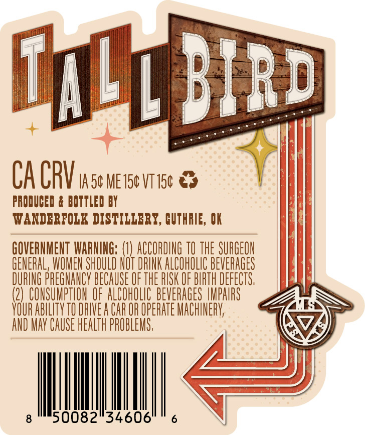
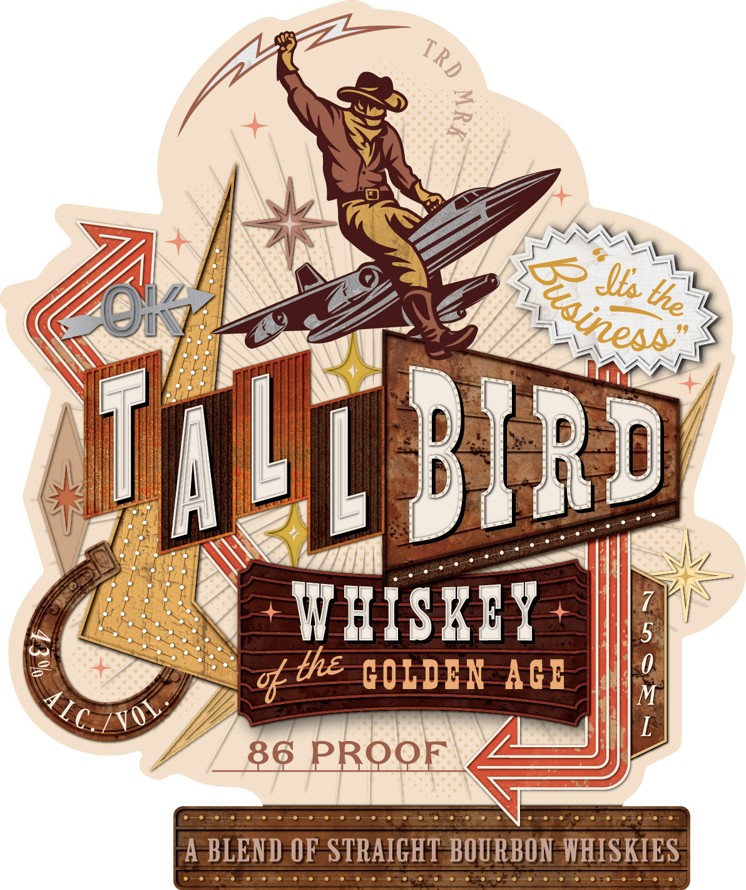

# TTB COLA Label Images - TTBID 26176001000269

**Brand Name:** TALLBIRD

**Issue Date:** 06/30/2026

**Origin Code:** 37

**Product Class/Type:** 121

**Source:** [TTB Public COLA Registry](https://ttbonline.gov/colasonline/viewColaDetails.do?action=publicFormDisplay&ttbid=26176001000269)

## Label Images

### Back Label

### Front Label

## Extracted Label Text

*Text extracted via OCR - may contain errors*

### Back Label

CA CRV ise ner

PRODUCED & BOTTLED BY

Bev ibe ee

WANDERFOLK DISTILLERY, GUTHRIE, OK

GOVERNMENT WARNING:
GENERAL, WOMEN SHOUL
DURING PREGNANCY BECA
(2) CONSUMPTION OF A
YOUR ABILITY 10 nite

32>

AGEON
AGES
FECTS,
HOLIC BEVERAGES IMPAIRS
A a

1) ACCORDING 10 THE §
T DRINK ALCOHOLIC BEV
OF THE RISK OF BIRTH D

SS55

AND MAY CAUSE HEALTH

### Front Label

2
T
ALp BRd
7
W HISKIY
2
C0LDEN AGE
;
86 PROQF
BLEND OF STRAIGHT BOURBON WHISKIES
TRD
I4
'Zusinesr"
Slea
the
% the
IIC 7voY
