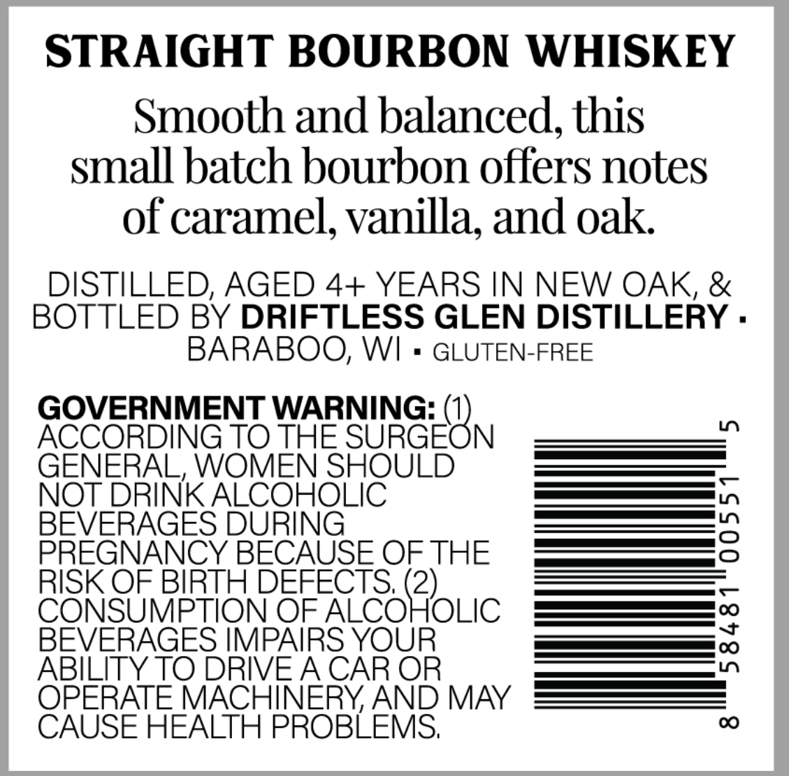
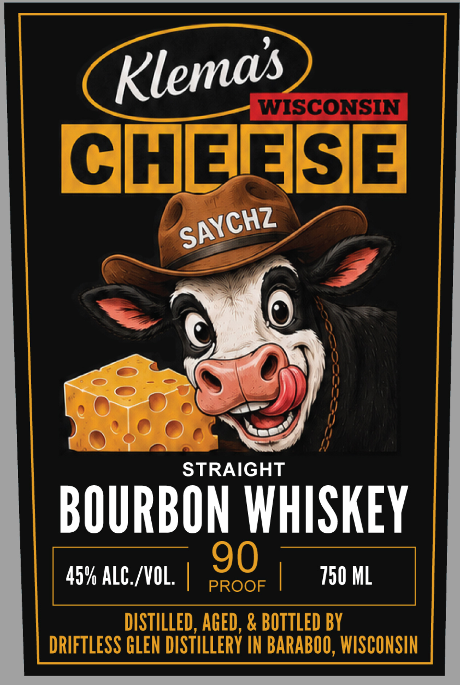

# TTB COLA Label Images - TTBID 26176001000273

**Brand Name:** KLEMA'S WISCONSIN CHEESE

**Issue Date:** 07/01/2026

**Origin Code:** 48

**Product Class/Type:** 101

**Source:** [TTB Public COLA Registry](https://ttbonline.gov/colasonline/viewColaDetails.do?action=publicFormDisplay&ttbid=26176001000273)

## Label Images

### Back Label

### Front Label

## Extracted Label Text

*Text extracted via OCR - may contain errors*

**Detected Proof:** 90

### Back Label

STRAIGHT BOURBON WHISKEY
Smooth and balanced, this
small batch bourbon offers notes
of caramel, vanilla; and oak
DISTILLED; AGED 4+ YEARS IN NEW OAK, &
BOTTLED BY DRIFTLESS GLEN DISTILLERY .
BARABOO, WI
GLUTEN-FREE
GOVERNMENT WARNING:
ACCORDING TO THE
SUGEBN
1
GENERAL, WOMEN SHOULD
NOT DRINK ALCOHOLIC
BEVERAGES DURING
3
PREGNANCY BECAUSE OF THE
RISK OF BIRTH DEFECTS;
CONSUMPTION OF
eoQoLIc
BEVERAGES IMPAIRS YOUR
3
ABILITY TO DRIVEACAR OR
OPERATE MACHINERYAND MAY
CAUSE HEALTH PROBLEMS;
00

### Front Label

WISCONSIN
CHEIASE
STRAIGHT
BOURBON WHISKEY
90
45% ALC /VOL:
PROOF
750 ML
DISTILLED, AGED, & BOTTLED BY
DRIFTLESS GLEN DISTILLERY IN BARABOO, WISCONSIN
Klemas
SAYCHZ
8
