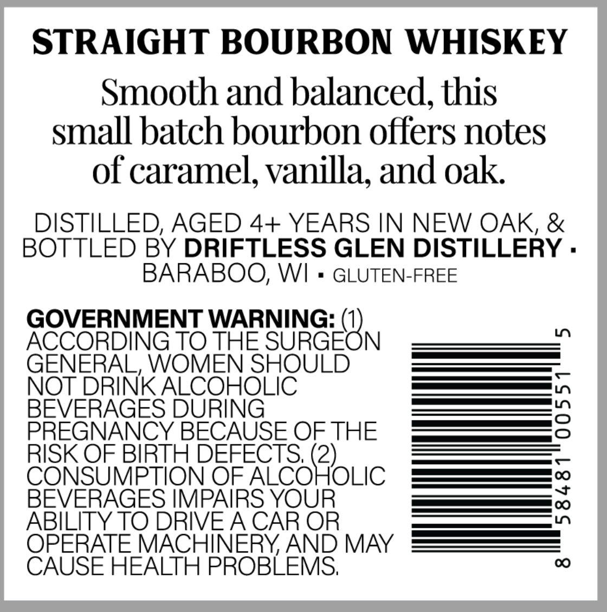
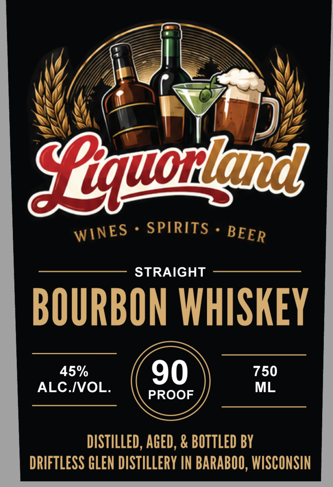

# TTB COLA Label Images - TTBID 26176001000301

**Brand Name:** LIQUORLAND

**Issue Date:** 06/30/2026

**Origin Code:** 48

**Product Class/Type:** 101

**Source:** [TTB Public COLA Registry](https://ttbonline.gov/colasonline/viewColaDetails.do?action=publicFormDisplay&ttbid=26176001000301)

## Label Images

### Back Label

### Front Label

## Extracted Label Text

*Text extracted via OCR - may contain errors*

**Detected Proof:** 90

### Back Label

STRAIGHT BOURBON WHISKEY
Smooth and balanced, this
small batch bourbon offers notes
of caramel, vanilla; and oak
DISTILLED; AGED 4+ YEARS IN NEW OAK, &
BOTTLED BY DRIFTLESS GLEN DISTILLERY .
BARABOO; WI
GLUTEN-FREE
GOVERNMENT WARNING: (1)
L
ACCORDING TO THE SURGEON
GENERAL, WOMEN SHOULD
NOT DRINK ALCOHOLIC
BEVERAGES DURING
3
PREGNANCY BECAUSE OFTHE
RISK OF BIRTH DEFECTS; (2)
CONSUMPTION OF ALCOHOLIC
BEVERAGES IMPAIRS YOUR
;
ABILITY TO DRIVEACAR OR
OPERATE MACHINERYAND MAY
CAUSE HEALTH PROBLEMS;
0

### Front Label

GqwoiLud
SPIRITS
STRAIGHT
BOURBON WHISKEY
45%
90
750
ALC IVOL.
ML
PROOF
DISTILLED, AGED, & BOTTLED BY
DRIFTLESS GLEN DISTILLERY IN BARABOO, WISCONSIN
WINES
BEER
