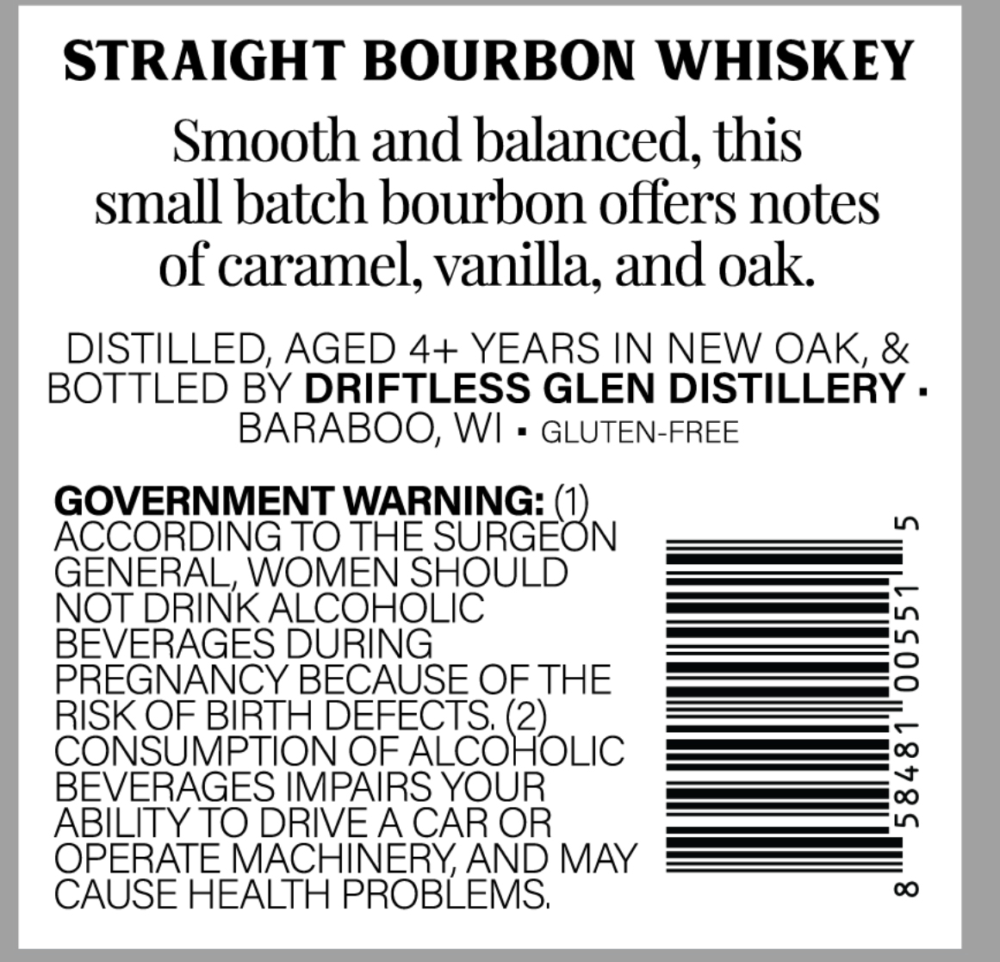
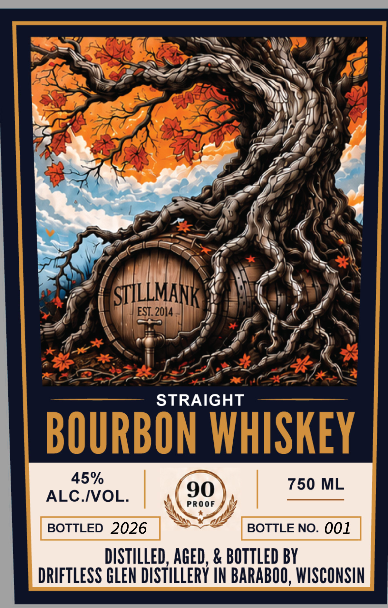

# TTB COLA Label Images - TTBID 26176001000330

**Brand Name:** STILLMANK

**Issue Date:** 07/07/2026

**Origin Code:** 48

**Product Class/Type:** 101

**Source:** [TTB Public COLA Registry](https://ttbonline.gov/colasonline/viewColaDetails.do?action=publicFormDisplay&ttbid=26176001000330)

## Label Images

### Back Label

### Front Label

## Extracted Label Text

*Text extracted via OCR - may contain errors*

**Detected Proof:** 90

### Back Label

STRAIGHT BOURBON WHISKEY
Smooth and balanced, this
small batch bourbon offers notes
of caramel, vanilla, and oak
DISTILLED; AGED 4+ YEARS IN NEW OAK, &
BOTTLED BY DRIFTLESS GLEN DISTILLERY .
BARABOO, WI
GLUTEN-FREE
GOVERNMENT WARNING:
ACCORDING TO THE
SUGEON
1
GENERAL, WOMEN SHOULD
NOT DRINK ALCOHOLIC
BEVERAGES DURING
3
PREGNANCY BECAUSE OF THE
RISK OF BIRTH DEFECTS, (2)
CONSUMPTION OF ALCOHOLIC
BEVERAGES IMPAIRS YOUR
{
ABILITY TO DRIVEA CAR OR
OPERATE MACHINERY AND MAY
CAUSE HEALTH PROBLEMS;
00

### Front Label

STILLMANK
EST. 2014
4
STRAIGHT
BOURBON WHISKEY
45%
750 ML
ALC IVOL:
90
PROOF
BOTTLED 2026
BOTTLE NO_
001
DISTILLED, AGED, & BOTTLED BY
DRIFTLESS GLEN DISTILLERY IN BARABOO, WISCONSIN
