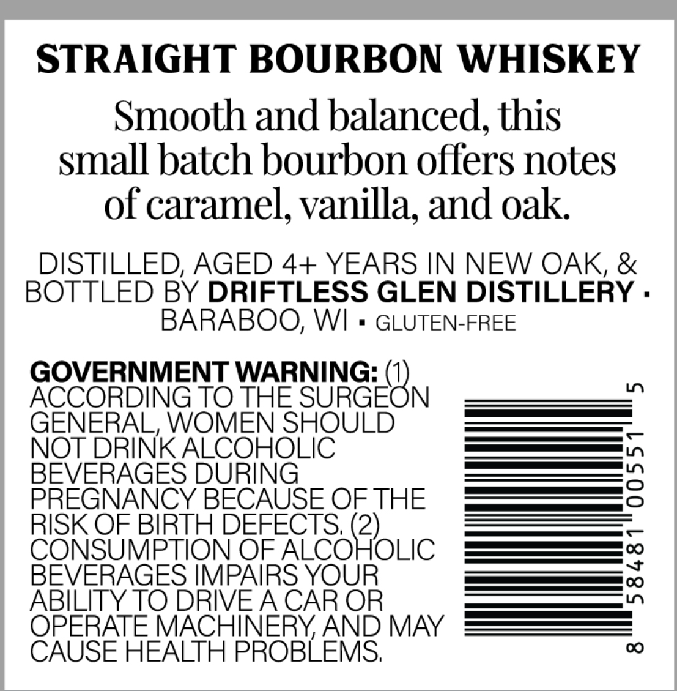
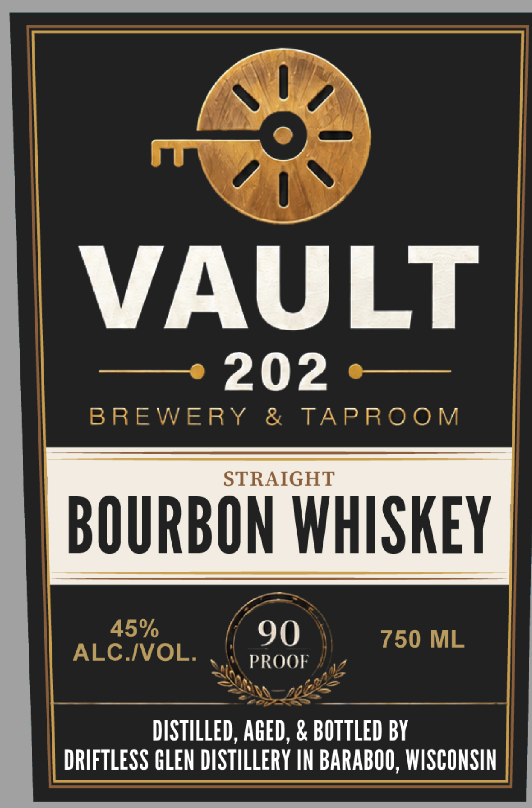

# TTB COLA Label Images - TTBID 26176001000367

**Brand Name:** VAULT 202 BREWERY & TAPROOM

**Issue Date:** 06/30/2026

**Origin Code:** 48

**Product Class/Type:** 101

**Source:** [TTB Public COLA Registry](https://ttbonline.gov/colasonline/viewColaDetails.do?action=publicFormDisplay&ttbid=26176001000367)

## Label Images

### Back Label

### Front Label

## Extracted Label Text

*Text extracted via OCR - may contain errors*

### Back Label

STRAIGHT BOURBON WHISKEY
Smooth and balanced; this
small batch bourbon offers notes
of caramel, vanilla; and oak
DISTILLED; AGED 4+ YEARS IN NEW OAK, &
BOTTLED BY DRIFTLESS GLEN DISTILLERY .
BARABOO; WI
GLUTEN-FREE
GOVERNMENT WARNING:
ACCORDING TO THE
SURGEON
LO
GENERAL, WOMEN SHOULD
NOT DRINK ALCOHOLIC
BEVERAGES DURING
3
PREGNANCY BECAUSE OF THE
RISK OF BIRTH DEFECTS; (2)
CONSUMPTION OF ALCOHOLIC
BEVERAGES IMPAIRS YOUR
;
ABILITY TO DRIVEACAR OR
OPERATE MACHINERY AND MAY
CAUSE HEALTH PROBLEMS;
00

### Front Label

LVN
prem Anil
7 ’
BREWERY & TAPROOM
Yai PROOF 7
DISTILLED, AGED, & BOTTLED BY
DRIFTLESS GLEN DISTILLERY IN BARABOO, WISCONSIN
