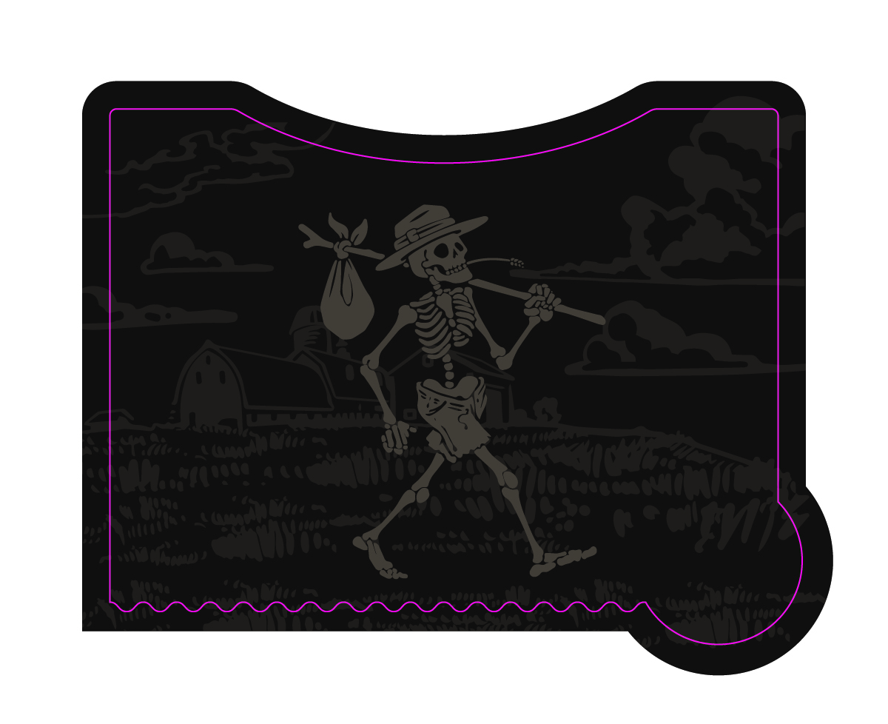
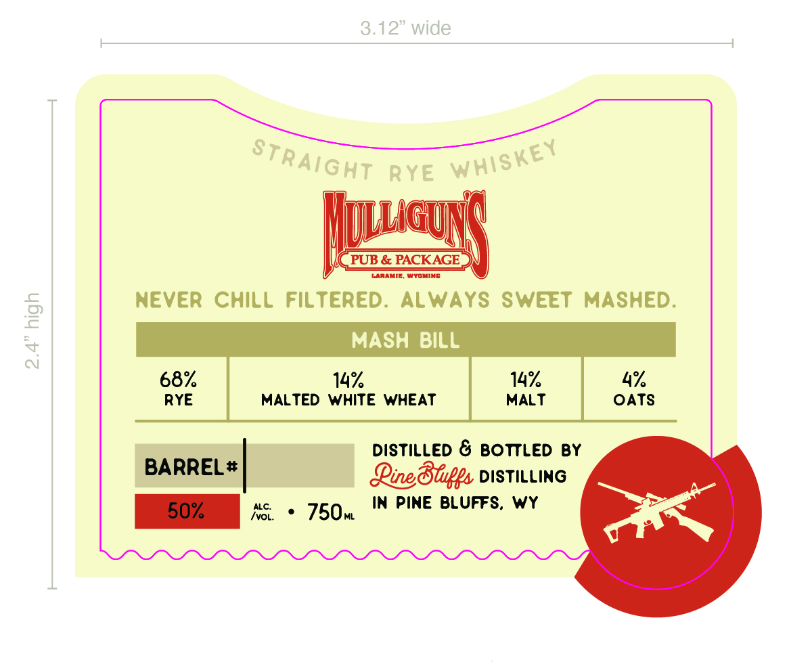

# TTB COLA Label Images - TTBID 26176001000411

**Brand Name:** PINE BLUFFS DISTILLING

**Fanciful Name:** MULLIGAN'S PUB & PACKAGE

**Issue Date:** 06/30/2026

**Origin Code:** 49

**Product Class/Type:** 102

**Source:** [TTB Public COLA Registry](https://ttbonline.gov/colasonline/viewColaDetails.do?action=publicFormDisplay&ttbid=26176001000411)

## Label Images

### Back Label

### Front Label

### Label 4

## Extracted Label Text

*Text extracted via OCR - may contain errors*

*2 image(s) excluded: text did not meet readability threshold*

**Detected Proof:** 136

### Front Label

3.12" wide
RYE
Illgl
PUB & PACKAGE
LAAAIE
WToMIAC
Never ChilL Filtered:
ALWAYS SWEET
MASHED:
2
MASH
BILL
4
68%
14
14%
4%
RYE
MALTED WHITE WHEAT
MALT
OATS
DistiLLEd & BOTTLED
BY
BARREL #
Qinedblps DISTiLLiNG
50%
ALC:
750w
In Pine BLUFFS,
wy
ivOL;
Straight
whiskey
