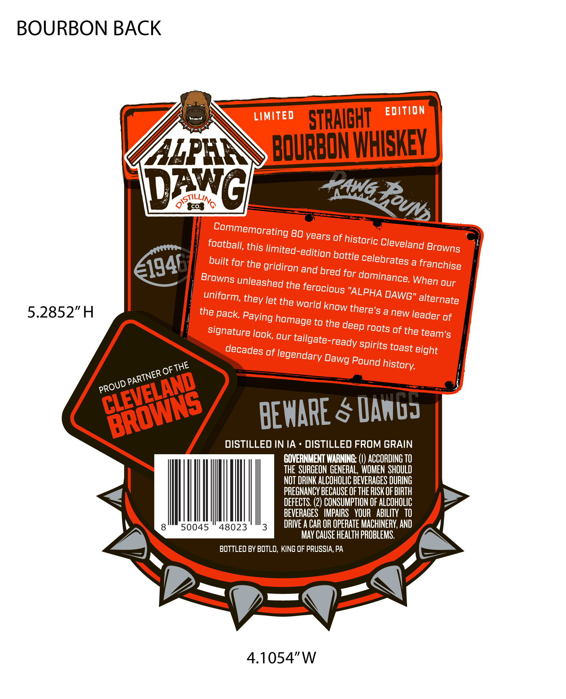
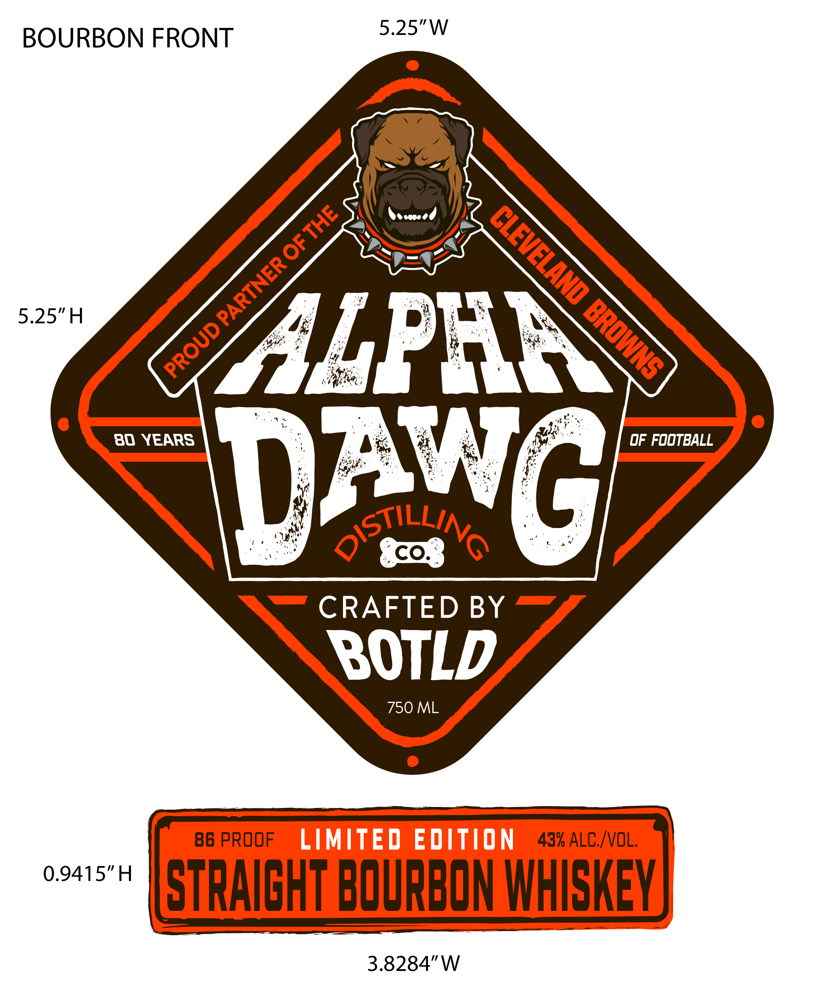

# TTB COLA Label Images - TTBID 26176001000431

**Brand Name:** ALPHA DAWG

**Issue Date:** 06/30/2026

**Origin Code:** 39

**Product Class/Type:** 101

**Source:** [TTB Public COLA Registry](https://ttbonline.gov/colasonline/viewColaDetails.do?action=publicFormDisplay&ttbid=26176001000431)

## Label Images

### Back Label

### Label 1

## Extracted Label Text

*Text extracted via OCR - may contain errors*

**Detected Proof:** 86

### Back Label

BOURBON BACK
LIMITED
STRAICHT
EDITION
HEPHIN
BOURDdMHHK
Dq
QSTILLINQ
Co
80 years of historic _
this
limited-edition
Cleveland
built for the gridiron _
celebrates
a
franchise
and
for
Browns unleashed the
our
"ALPHA QAWG" alternate
the world
5.2852"H
the pack Paying
a new leader of
to the
signature look; our
roots of the team's
decades of
'tailgate-ready spirits
eight
Pound
BEMARE & Danuz
DISTILLED IN IA
DISTILLED FROM GRAIN
GOVERNMENT WARNING: ,
ACCORDING TO
THE  SURGEON GENERAL, WOMEN  SHOULD
NOT DRINK ALCOHOLIC BEVERACES DURING
PREGNANCY BECAUSE Of THE RISK OF BIRTH
DEFECTS. (2) CONSUMPTION OF ALCOHOLIC
BEVERAGES   IMPAIRS   YOUR   ABILITY   TO
8
50045
48023
3
DRIVE A CAR OR OPERATE MACHINERY;, AND
MAY CAUSE HEALTh PROBLEMS.
BOTTLED BY BOTLD, KING OF PRUSSIA, PA
4.1054"W
PAWG RUNs
Commemorating
football;
Browns
bottle
e1946
bred
dominance:
When
ferocious
uniform,
they
let
know
there's
homage
deep
toast
legendary
Dawg
history:
THE
PARTNER OF
CLEVELAND
PROUD E
BROWNS

### Label 1

5.25"W
BOURBON FRONT
6
5.25"H
aLPHIa
80 YEARS
OF FOOTBALL
DawG
QStco WNQ
CO_
CRAFTED BY
BOTLD
750 ML
86 PROOF
LIMITED EDITION
43% ALC IVOL,
0.9415"H
STRAICHT BOURBON WHISKEY
3.8284"W
THE
8
PARTNER
BROWNS
PROUD
