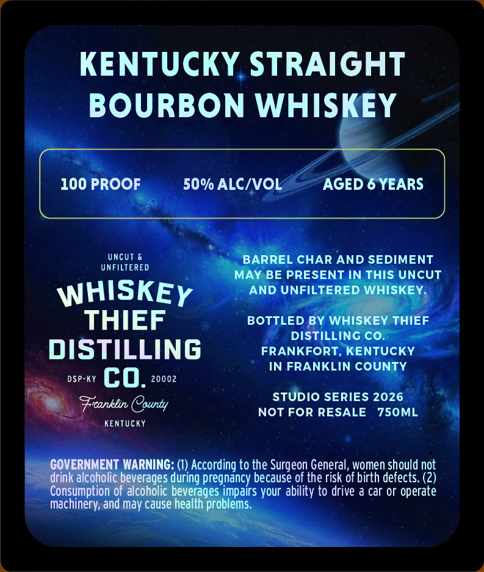
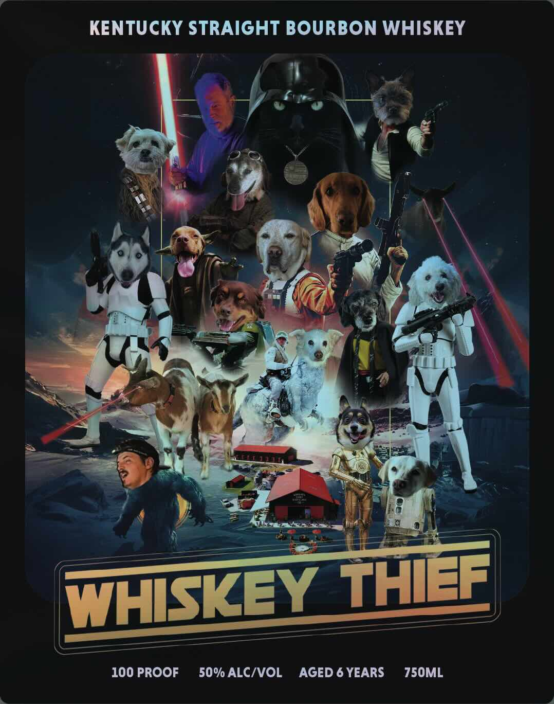

# TTB COLA Label Images - TTBID 26176001000611

**Brand Name:** WHISKEY THIEF DISTILLING CO.

**Issue Date:** 07/01/2026

**Origin Code:** 22

**Product Class/Type:** 101

**Source:** [TTB Public COLA Registry](https://ttbonline.gov/colasonline/viewColaDetails.do?action=publicFormDisplay&ttbid=26176001000611)

## Label Images

### Back Label

### Front Label

## Extracted Label Text

*Text extracted via OCR - may contain errors*

**Detected Proof:** 100
**Detected Age:** 6 Years

### Back Label

KENTUCKY STRAIGHT
BOURBON WHISKEY
100 PROOF
50% ALC/VOL
AGED 6 YEARS
UncUT
BARREL CHAR AND SEDIMENT
UNFILTERED
MAY BE PRESENT IN THIS UNCUT
WHISKEY
AND UNFILTERED WHISKEY
THIEF
BOTTLED BY WHISKEY THIEF
DISTILLING CO.
DISTILLING
FRANKFORT, KENTUCKY
IN FRANKLIN COUNTY
DSP-KY
co:
20002
STUDIO SERIES 2026
Fcanklin County
NOT FOR RESALE
750ML
KEnTUcKY
COVERNMENT WARNING: (1) According to the Surgeon General, women should not
drink alcoholic beverages during pregnancy because of the risk of birth defects: (2)
Consumption of alcoholic beverages impairs your ability to drive a car or operate
machinery; and
cause health problems:
may

### Front Label

KENTUCKY STRAIGHT BOURBON WHISKEY
WHISKEY THEE
100 PROOF
50% ALCIVOL
AGED 6 YEARS
750ML
