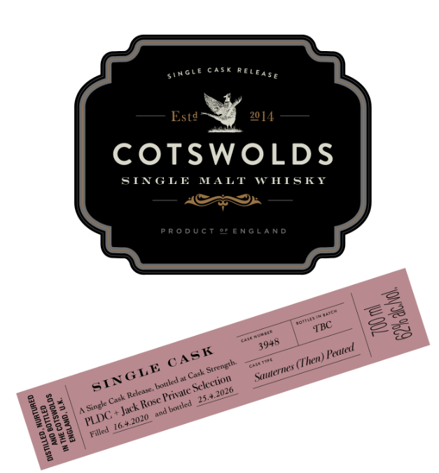
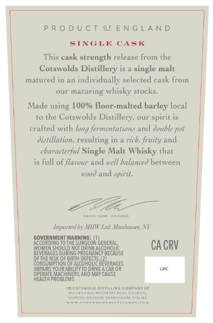

# TTB COLA Label Images - TTBID 26176001000739

**Brand Name:** COTSWOLDS

**Fanciful Name:** SAUTERNES THEN PEATED

**Issue Date:** 07/01/2026

**Origin Code:** 6P

**Product Class/Type:** 118

**Source:** [TTB Public COLA Registry](https://ttbonline.gov/colasonline/viewColaDetails.do?action=publicFormDisplay&ttbid=26176001000739)

## Label Images

### Label 1

### Label 2

## Extracted Label Text

*Text extracted via OCR - may contain errors*

### Label 1

cask
R € [
Estd
20 [4
COTSWOLDS
SINGLE
MALT
WIISIT
P R 0 D U C T
ENGLA N
Cask
3
94
Cte
45 €
5i
8
2
Jac #
J0u
TBC
Tauntt
39+8
Pcuted
ASK
(Then)
'Scrength
e
GLE
Sutterues
SINe
txked #
Selcction
2026
Relenee.
Friwale
1
154
1
Cak
Rose
Single
bottled
~Jack
1
ad
FLIC =
1
"2020
Filled
I

### Label 2

PRODUCT 29FENGLAND

SINGLE CASK

This cask strength release from the

Cotswolds Distillery is a single malt

matured in an individually selected cask from

our maturing whisky stocks.

‘Made using 100% floor-malted barley local

to the Cotswolds Distillery, our spirit is

crafted with long fermentations and double pot

distillation, resulting in a rich, fruity and

characterful Single Malt Whisky that

is full of flavour and well balanced between

wood and wpirit.

La

amie ston -rounoee

Imported by MENW Lad. Manhasset, NY

GOVERNMENT WARN!

ACCORDING TO THE SURGEON

WOMEN SHOULD NOT ORIN,

Ht bencaa

CACRV

RAGES

PREGNA

tebe

OFTHE Rsk OF BIRTH DEFECTS,

CONSUMPTION

ALCOHOLIC

RAGES

OPERATE MACHINERY AND MAY CAUS|

IRS YOUR:

ILITYTO DRIVE ACAR OR

HEAITH PROBLEM:

—_

lat coTswoLo DISTILUNG COMPANY Ue

en non, stunton

Sarstononso
