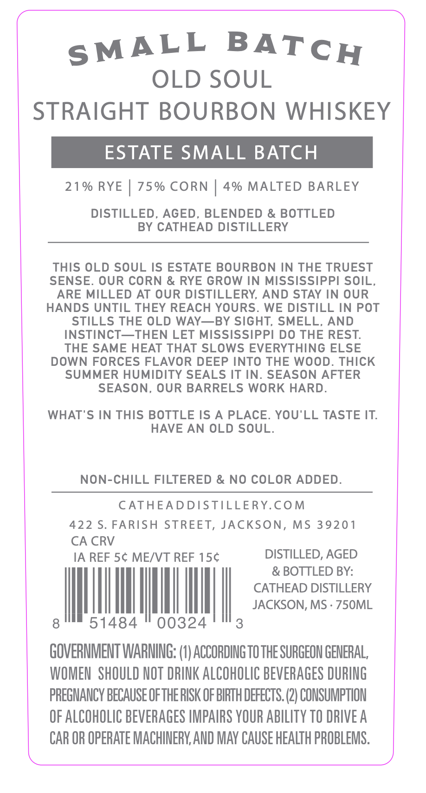
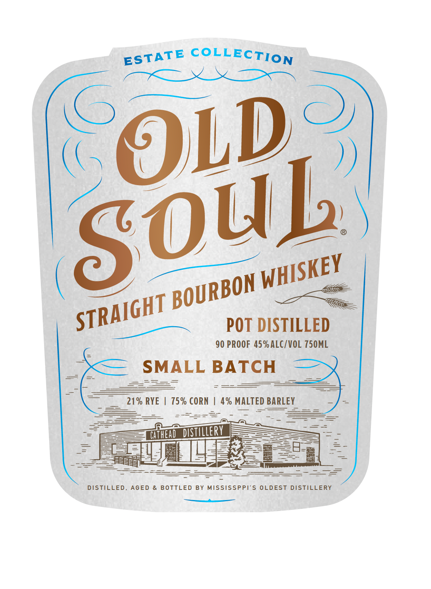

# TTB COLA Label Images - TTBID 26177001000226

**Brand Name:** OLD SOUL

**Fanciful Name:** SMALL BATCH

**Issue Date:** 07/01/2026

**Origin Code:** 28

**Product Class/Type:** 101

**Source:** [TTB Public COLA Registry](https://ttbonline.gov/colasonline/viewColaDetails.do?action=publicFormDisplay&ttbid=26177001000226)

## Label Images

### Back Label

### Front Label

## Extracted Label Text

*Text extracted via OCR - may contain errors*

**Detected Proof:** 90

### Back Label

OLD SOUL
STRAIGHT BOURBON WHISKEY
ESTATE SMALL BATCH
21 % RYE
75% CORN
4% MALTED BARLEY
DISTILLED, AGED, BLENDED & BOTTLED
BY CATHEAD DISTILLERY
THIS OLD SOUL IS ESTATE BOURBON IN THE TRUEST
SENSE: OUR CORN & RYE GROW IN MISSISSIPPI SOIL,
ARE MILLED AT OUR DISTILLERY, AND STAY IN OUR
HANDS UNTIL THEY REACH YOURS.
WE DISTILL IN POT
STILLS THE OLD WAY__BY SIGHT, SMELL, AND
INSTINCT_THEN LET MISSISSIPPI DO THE REST:
THE SAME HEAT THAT SLOWS EVERYTHING ELSE
DOWN FORCES FLAVOR DEEP INTO THE WOOD. ThICK
SUMMER HUMIDITY SEALS IT IN_
SEASON AFTER
SEASON, OUR BARRELS WORK HARD.
WHAT'S IN THIS BOTTLE IS A PLACE: YOU'LL TASTE IT:
HAVE AN OLD SOUL.
NON-CHILL FILTERED & NO COLOR ADDED.
CATHEADDISTILLERY.COM
422 $. FARISH STREET, JACKSON, MS 39201
CA CRV
IA REF 5c MEIVT REF 15c
DISTILLED, AGED
& BOTTLED BY:
CATHEAD DISTILLERY
JACKSON, MS
75OML
8
51484
00324
3
GOVERMMENT WARMING: (0) ACCORDING TOTHE SURGEON GENERAL,
WOMEN   SHOULD NOT DRINK ALCOHOLIC BEVERAGES DURING
PREGMANCY BECAUSE OFTHE RISK OF BIRTH DEFECTS. (2} CONSUMPTION
OF ALCOHOLIC BEVERAGES IMPAIRS VOUR AbILITY TO DRIVE A
CAR OR OPERATE MACHIMERY AND MAY CAUSE HEALTH PROBLEMS.
BATCH
SMALL

### Front Label

COLLECTION
OL)
PoT DISTILLED
90 PROOF 45% ALC/VOL 750ML
SMALL BATCH
21 % RYE
75% CORN
4% MALTED BARLEY
Cifheng _distillerV
DISTILLED, AGED
& BOTTLED
BY MISSISSPPI'S OLDEST DISTILLERY
ESTATE
SOu]
WHISKEY
BOURBON
STRAIGHT
