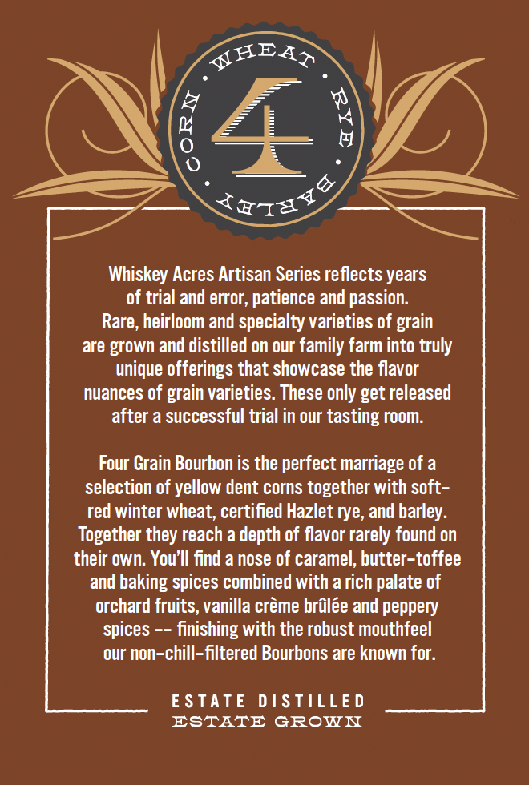
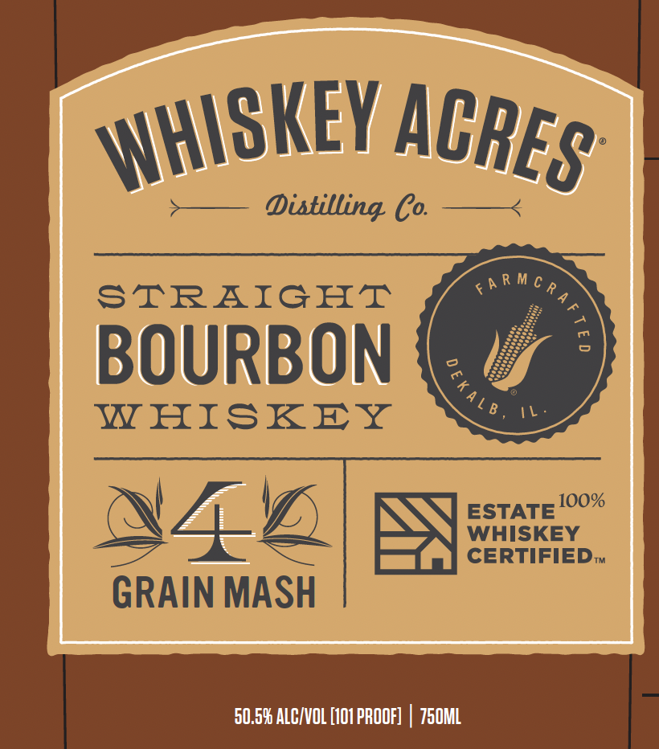
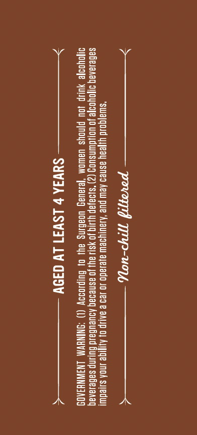

# TTB COLA Label Images - TTBID 26177001000267

**Brand Name:** WHISKEY ACRES DISTILLING CO.

**Issue Date:** 07/01/2026

**Origin Code:** 04

**Product Class/Type:** 101

**Source:** [TTB Public COLA Registry](https://ttbonline.gov/colasonline/viewColaDetails.do?action=publicFormDisplay&ttbid=26177001000267)

## Label Images

### Back Label

### Front Label

### Label 3

### Label 4

## Extracted Label Text

*Text extracted via OCR - may contain errors*

**Detected Proof:** 101

### Back Label

JHEA?
Whiskey Acres Artisan Series reflects years
of trial and error, patience and passion.
Rare, heirloom and specialty varieties of grain
are grown and distilled on our family farm into truly
unique offerings that showcase the flavor
nuances of grain varieties. These only get released
after a successful trial in our tasting room:
Four Grain Bourbon is the perfect marriage of a
selection of yellow dent corns together with soft -
red winter wheat; certified Hazlet rye, and barley:
Together they reach a depth of flavor rarely found on
their own. You'II find a nose of caramel, butter-toffee
and baking spices combined with a rich palate of
orchard fruits, vanilla creme brulee and peppery
spices
finishing with the robust mouthfeel
our non-chill-filtered Bourbons are known for.
E STATE
D [STILLE D
ESTATE
GROWI
0
3
Tays

### Front Label

Distilling Co
F a R M c p
STRAIGHT
BOURBON
WHISKEY
100%
ESTATE
4
WHISKEY
CERTIFIEDt
GRAIN MASH
50.59 ALCIVOL [101 PROOF]
750ML
WHISKEY
ACRES
0

### Label 3

PE) EES JF
*slua|gold yljeay asned AeW pUe ‘ALaUIy9eW ajelado JO 129 e aALJp O fe InOA siiedwt

$aGesanag o1oyoofe JO Uo}dwWnsuog (2) "si9a}ap YiNIg JOYSL! Ay) Jo asnedag ADUEUBaLd BulINp saBelanaq
D1OYoo]e YUIIP JOU P[noys UAwWOM ‘Jelavag UOaBINg ay) o) Guypodoy (1) “ONINHVM LNSWNH3A09

>——————— Sava ¢ LSW31 LY d39y ——————<

### Label 4

1100¢-1-dS0
mor voysohoyrTyn ‘ ¢
gra via, pu V0} VOL S109 11 S1VNI0 & od SNITILSIO SIUOV AJNSIHM

AQ OFILLOG ONY GATIUSIO NMOUD
