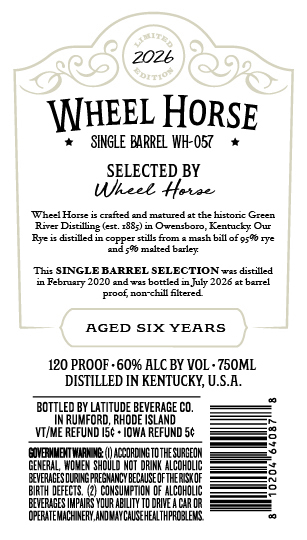
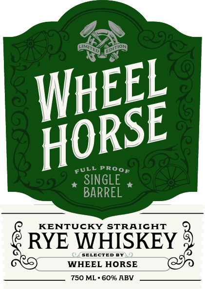

# TTB COLA Label Images - TTBID 26177001000305

**Brand Name:** WHEEL HORSE

**Issue Date:** 06/30/2026

**Origin Code:** 40

**Product Class/Type:** 102

**Source:** [TTB Public COLA Registry](https://ttbonline.gov/colasonline/viewColaDetails.do?action=publicFormDisplay&ttbid=26177001000305)

## Label Images

### Back Label

### Front Label

## Extracted Label Text

*Text extracted via OCR - may contain errors*

**Detected Proof:** 120

### Back Label

2026

HEEL HORSE

x SINGLE BARREL WH-O57

SELECTED BY

eek Herve

‘Wheel Hire is cafed and matured atthe historic Green

‘River Dillng (et. 288) in Owensboro, Kentucky Our

[Byes dntilled in copper stile fom a mach bill of 990 rye

‘aids malted balay

‘This SINGLE BARREL SELECTION we distilled

‘x Febraary 2020 anne beta in uly 2026 ot bevel

proof nomehill tered

AGED SIX YEARS

120 PROOF -60% ALC BY VOL- 750ML

DISTILLED IN KENTUCKY, U.S.A.

BOTTLED BY LATITUDE BEVERAGE CO.

IN RUMFORD, RHODE ISLAND.

\VI/ME REFUND IS¢~ IOWA REFUND S¢

——

CORON TOTEM See

GENERAL WOMEN SHOULD NOT DRI ALCOHOLIC

RIN PEM

OFT

BRT DEFECTS. (2) COASUMETION OF ALCOHOLIC

EERASESMPURS YOUR BLT TORE AChR OR

COPRATE NACHE AOA COUSEHEA APRONS

### Front Label

SINGLE
BARREL
KENTUCKY STRAIGHT
RYE WHISKEY
WHEEL HORSE
750 ML ' 60% ABV
ITIOH
WhEEL
HORSE
ProoF
FuLL
